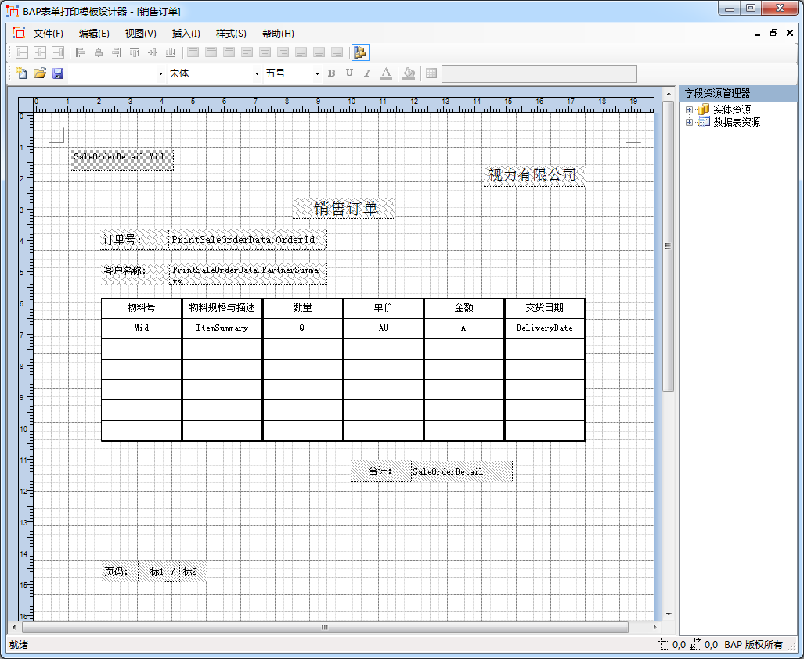
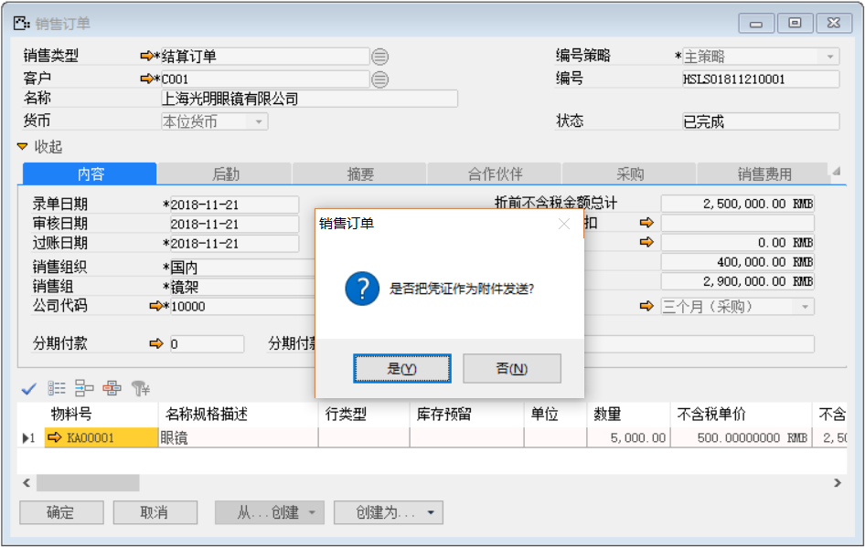
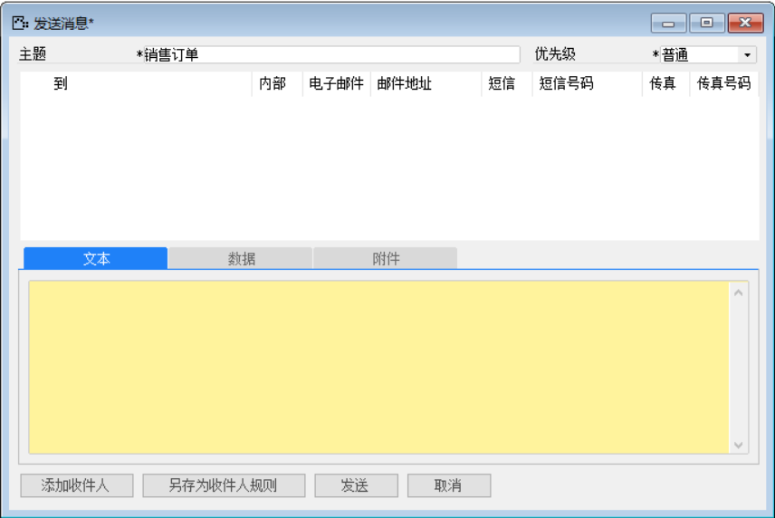
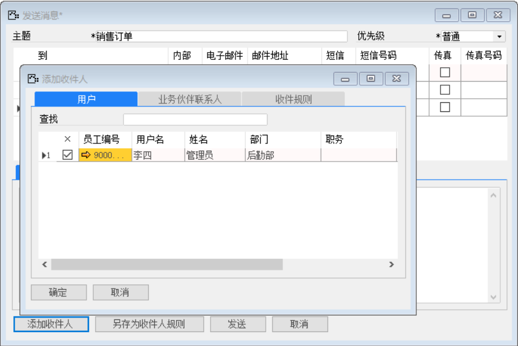
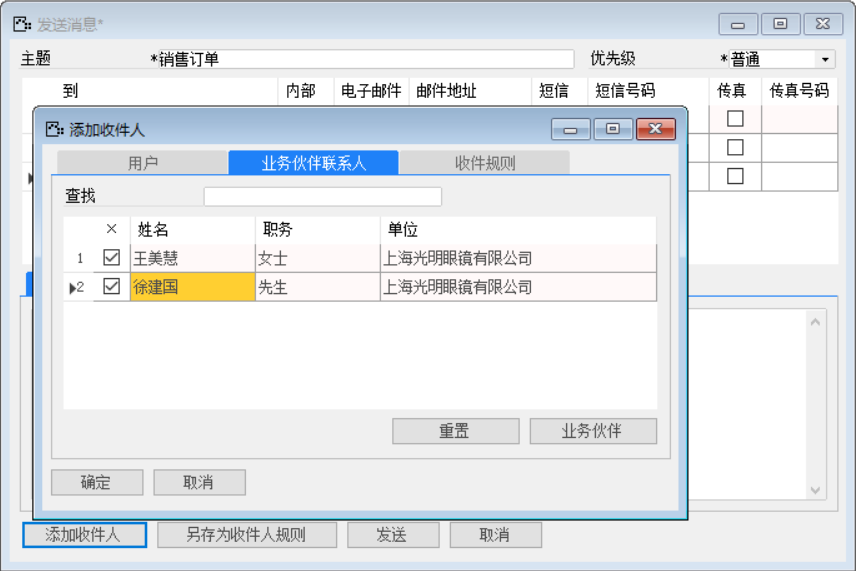
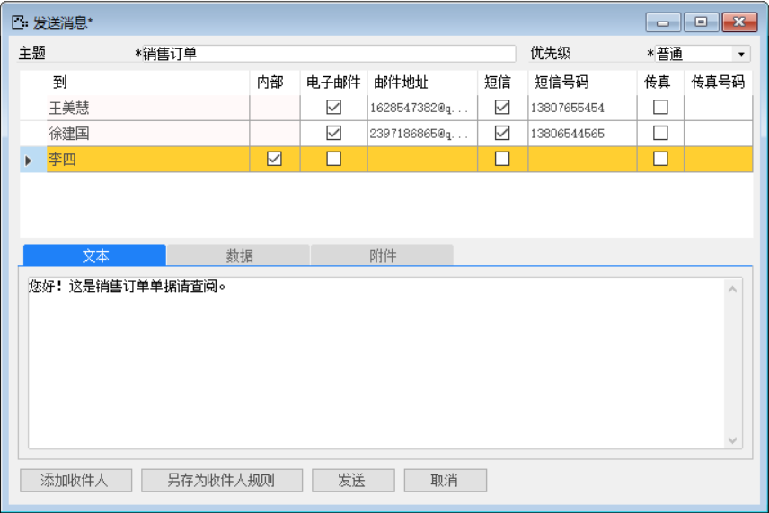
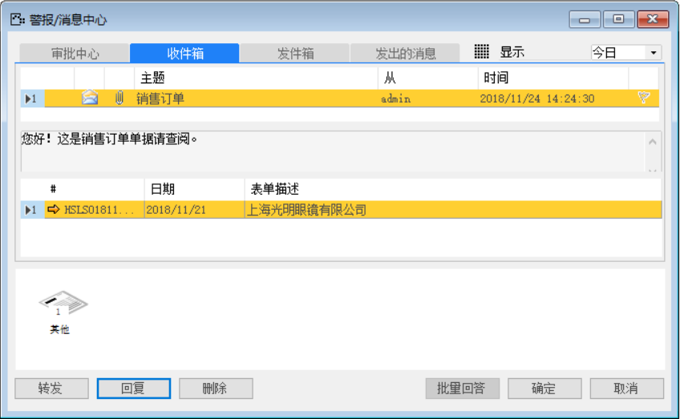

#### **概述**

本节介绍消息发送/邮件/传真，用邮件、短信、传真的方式将单据与信息发送到客户联系人或用户。

#### **步骤**

打开路径：菜单栏—数据—发送消息

1、 打开单据：销售订单，定义此订单的打印格式

*注：具体的打印格式设计请看数据与工作流章节的打印组与格式设计。*

 

2、 需先打开单据界面：销售订单，再打开【消息发送】界面并将销售订单凭证作为附件，定义新的“消息发送”；

- 主题：销售订单；

- 优先级：选择普通；

 

 

3、 添加收件人;

 

 

4、 填写收件人信息及文本；

收件人信息：

| **收件人** | **内部** | **电子邮件** | **邮箱地址**      | **短信** | **短信号码** | **传真** | **传真号码** |
| ---------- | -------- | ------------ | ----------------- | -------- | ------------ | -------- | ------------ |
| 王美慧     |          | ✔            | 1628547382@qq.com | ✔        | 13807655454  |          |              |
| 徐建国     |          | ✔            | 2397186865@qq.com | ✔        | 13806544565  |          |              |
| 李四       | ✔        |              |                   |          |              |          |              |

	

	文本内容：“您好！这是销售订单单据请查阅”。

 

*注：添加好收件人后以另存为收件人规则，下次添加收件人时可以直接添加收件人规则。*

5、 切换用户查看警报/消息中心内收件箱；

