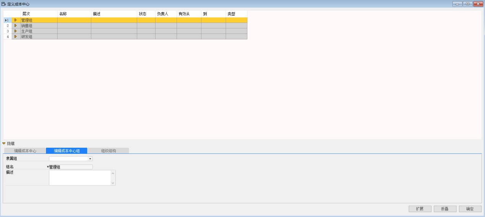
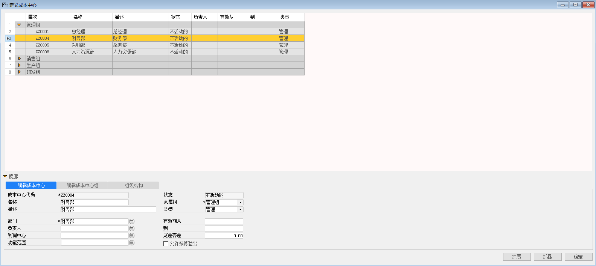
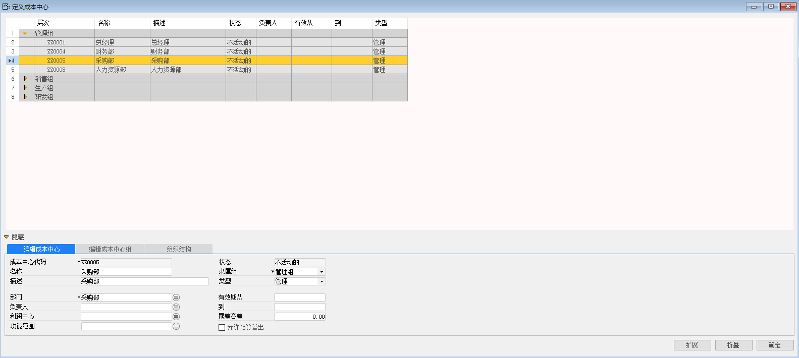
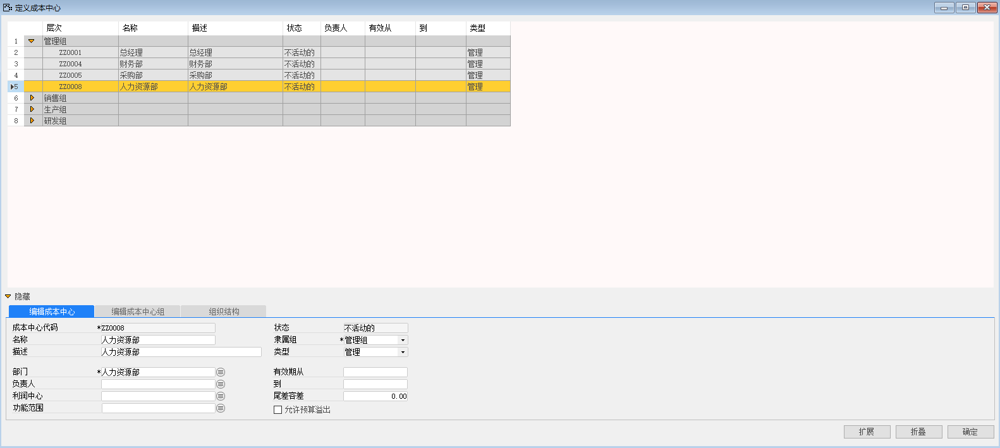

#### **概述**

本章主要讲解如何在系统内配置成本中心。

#### **步骤**

1、 打开路径：管理会计-定义-成本中心；

2、 在编辑成本中心组页签下定义编辑成本中心组组名；

3、 编辑各项信息后，左击‘添加’按钮。

- 管理组

- 销售组

- 生产组

- 研发组

 

4、 在编辑成本中心界面定义各成本中心组对应的成本中心；

5、 编辑完成后左击‘添加’按钮。

- 成本中心代码：ZZ0001

- 名称：总经理

- 描述：总经理

- 部门：总经理

- 隶属组：管理组

- 类型：管理

 

- 成本中心代码：ZZ0004；

- 名称：财务部

- 描述：财务部

- 部门：财务部

- 隶属组：管理组

- 类型：管理

 

- 成本中心代码：ZZ0005；

- 名称：采购部

- 描述：采购部

- 部门：采购部

- 隶属组：管理组

- 类型：管理

 

- 成本中心代码：ZZ0008

- 名称：人力资源部

- 描述：人力资源部

- 部门：人力资源部

- 隶属组：管理组

- 类型：管理

