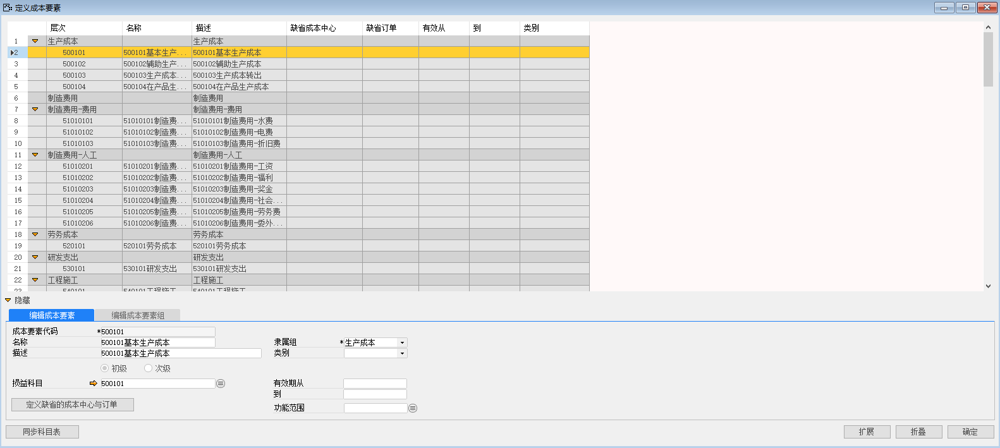
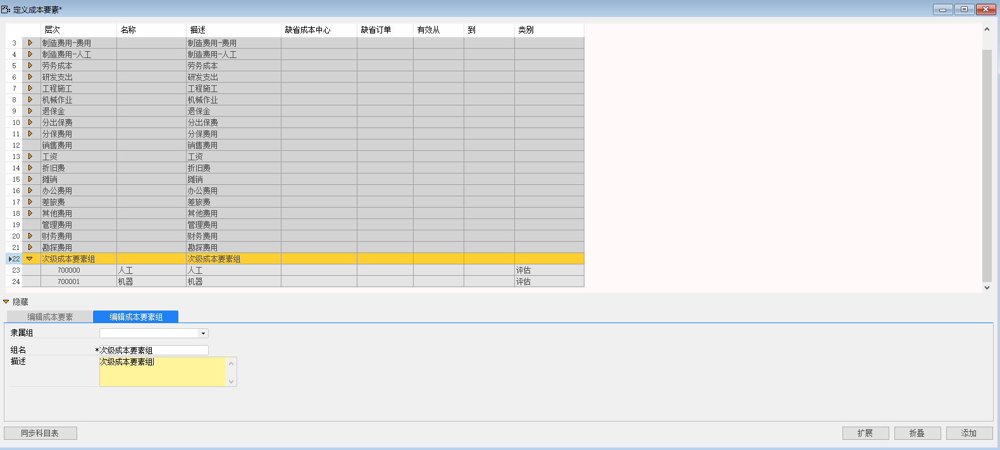
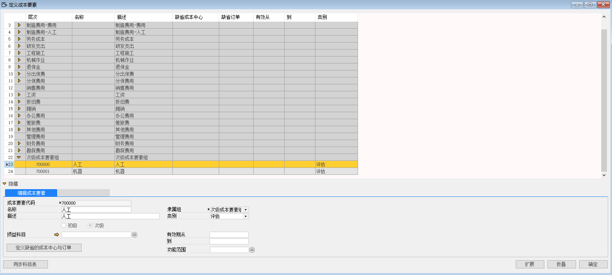
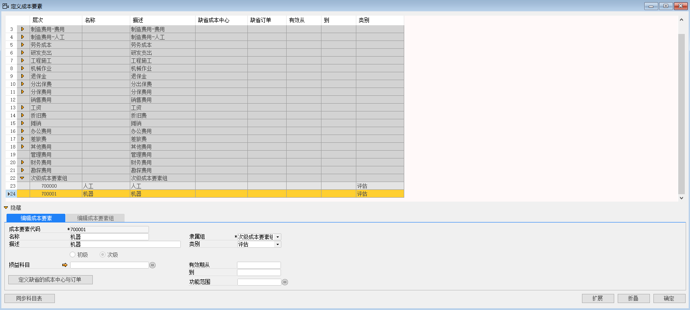

#### **概述**

本章主要讲解如何在系统内配置成本要素。

#### **步骤**

一、 **定义初级成本要素**

1、 打开路径：管理会计-定义-成本要素；

2、 左击‘同步科目表’按钮，系统会自动将初级成本要素同步完成；

 

二、 **定义次级成本要素**

1、 打开路径：管理会计-定义-成本要素；

2、 在编辑成本要素组页签下定义编辑成本要素组组名；

3、 编辑各项信息后，左击‘添加’按钮。

- 次级成本要素组

 

4、 在编辑成本要素界面定义次级成本要素组下的次级成本要素；

5、 添加完成后，左击‘添加’按钮。

- 成本要素代码：700000

- 名称：人工

- 描述：人工

- 勾选：次级

- 隶属组：次级成本要素组

- 类别：评估

 

- 成本要素代码：700001

- 名称：机器

- 描述：机器

- 勾选：次级

- 隶属组：次级成本要素组

- 类别：评估

