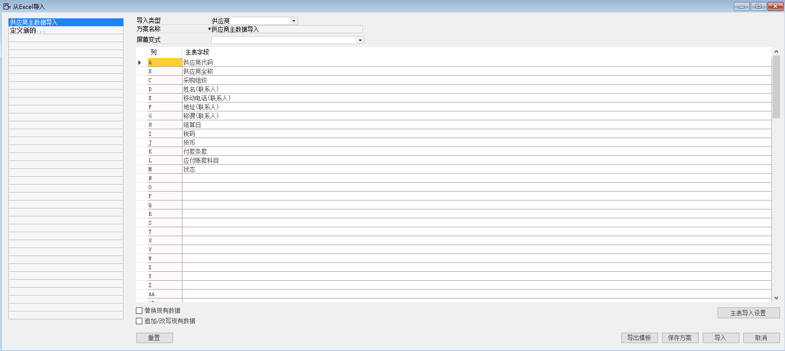
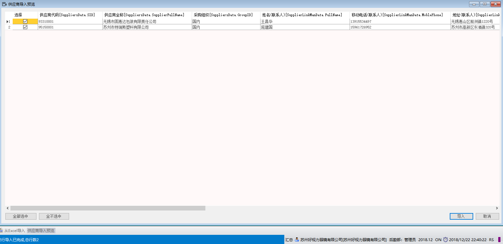

#### **概述**

本章主要讲解如何运用系统导入功能，将供应商主数据导入到系统中。

#### **步骤**

例如：对苏州好视力眼镜有限公司供应商主数据进行录入，步骤如下：

1、 打开路径：从菜单窗口，管理-数据导入-从EXCEL导入；

2、 选择导入类型，左击‘定义新的…’按钮，填写方案名称； 

- 导入类型：供应商

- 方案名称：供应商主数据导入 

3、选择EXCEL对应的主要字段；

A：供应商代码

B: 供应商全称

C: 采购组织

D: 姓名（联系人）

E: 移动电话（联系人）

F: 地址（联系人）

G: 称谓（联系人）
H: 结算日

I: 税码

J: 货币

K: 付款条款

L: 应付账款科目

M: 状态

 

1、 左击‘保存方案’进行保存;

2、 左击‘导出模板’按钮将模板导出，将导出的模板进行供应商主数据的整理（模板见EXCEL供应商主数据）；

3、 左击‘导入’，在计算机本地选择整理好的供应商主数据模板，左击‘打开’，进入供应商导入预览界面，左击‘全部选中’按钮，左击‘导入’按钮，系统提示‘确定导入？’左击‘确定’按钮，开始导入（模板见EXCEL供应商主数据）；

 

4、 导入成功后，系统左下角信息栏会提示导入成功，并可在系统菜单 采购-供应商主数据或托查询 采购-供应商 内查看导入的供应商主数据。

