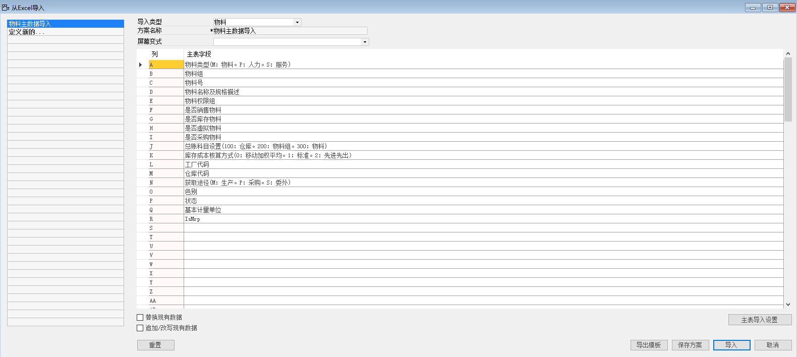
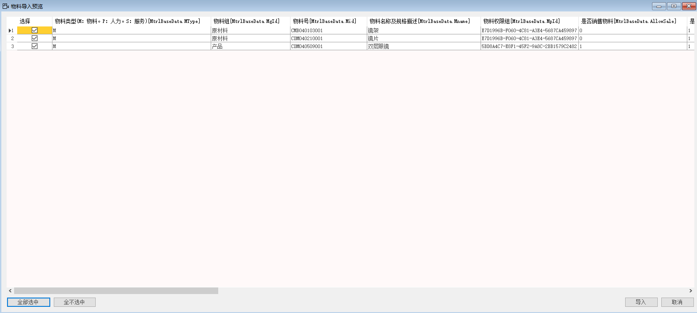

#### **概述**

本章主要讲解如何运用系统导入功能，将物料主数据导入到系统中。

#### **步骤**

例如：对苏州好视力眼镜有限公司物料主数据进行录入，步骤如下：

1、 打开路径：从菜单窗口，管理-数据导入-从EXCEL导入；

2、 选择导入类型，左击‘定义新的…’按钮，填写方案名称； 

- 导入类型：物料

- 方案名称：物料主数据导入

3、 选择EXCEL对应的主要字段；

A：物料类型（M:物料。P:人力。S:服务）

B: 物料组（导入时支持描述）

C: 物料号

D: 物料名称及规格描述

E: 物料权限组（导入时支持描述）

F: 是否销售物料

G: 是否库存物料

H: 是否虚拟物料

I: 是否采购物料

J: 总账科目设置（100：仓库。200：物料组。300：物料）

K: 库存成本核算方式（0：移动加权平均。1：标准。2：先进先出）

L: 工厂代码

M: 仓库代码

N: 获取途径（M:生产。P:采购。S:委外）

O: 色别

P: 状态

Q: 基本计量单位

R: IsMrp

 

4、左击‘保存方案’进行保存;

5、左击‘导出模板’按钮将模板导出，将导出的模板进行物料主数据的整理（模板见EXCEL物料主数据）；

6、左击‘导入’，在计算机本地选择整理好的物料主数据模板，左击‘打开’，进入物料主数据导入预览界面，左击‘全部选中’按钮，左击‘导入’按钮，系统提示‘确定导入？’左击‘确定’按钮，开始导入（模板见EXCEL物料主数据）；

 

7、 导入成功后，系统左下角信息栏会提示导入成功，并可在系统菜单 库存-物料主数据或托查询 库存-物料内查看导入的供应商主数据。