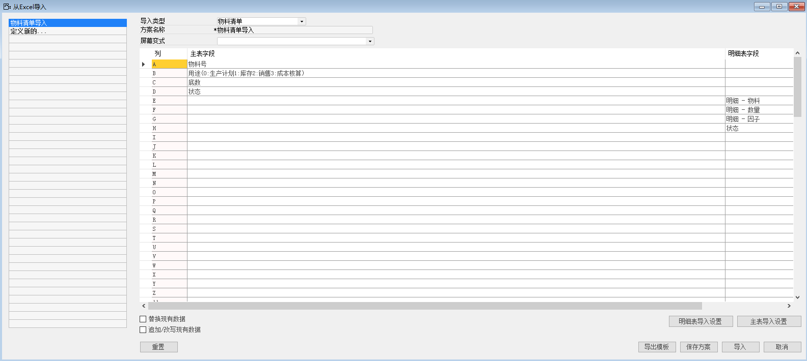
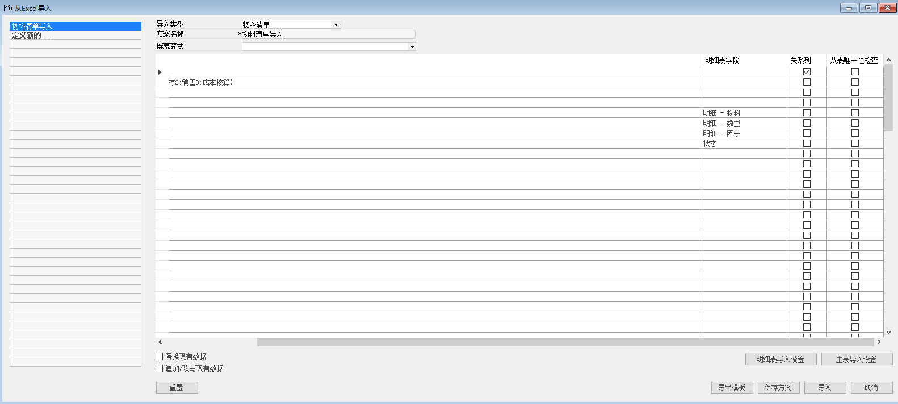
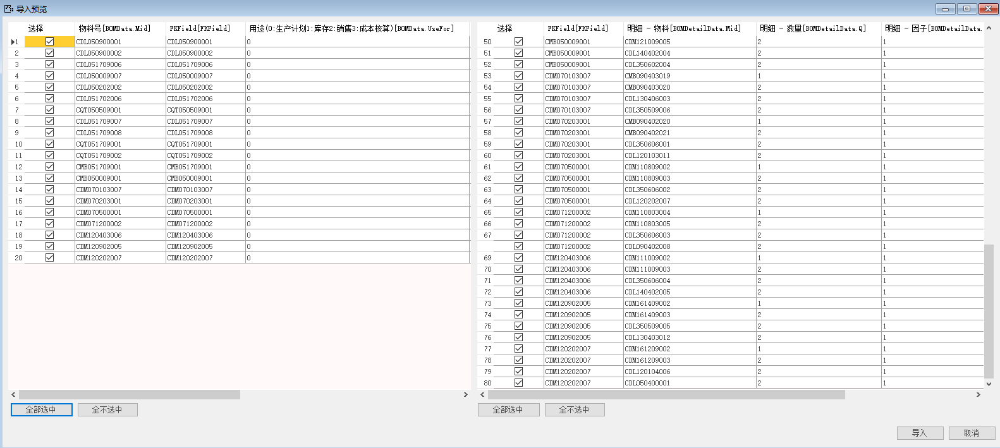

#### **概述**

本章主要讲解如何运用系统导入功能，将物料清单导入到系统中。

#### **步骤**

例如：对苏州好视力眼镜有限公司物料清单进行录入，步骤如下：

1、 打开路径：从菜单窗口，管理-数据导入-从EXCEL导入；

2、 选择导入类型，左击‘定义新的…’按钮，填写方案名称； 

- 导入类型：物料清单

- 方案名称：物料清单导入

3、 选择EXCEL对应的主要字段，并勾选关系列：主表字段-物料号；

**主表字段**

A：物料号

B: 用途（0：生产计划。1：库存。2：销售。3：成本核算）

C: 底数

D: 状态

**明细表字段**

E: 明细-物料

F: 明细-数量

G: 明细-因子

H: 状态

关系列：物料号

 

 

4、左击‘保存方案’进行保存;

5、左击‘导出模板’按钮将模板导出，将导出的模板进行物料清单的整理（模板见EXCEL物料清单）；

1、 左击‘导入’，在计算机本地选择整理好的物料清单模板，左击‘打开’，进入物料清单导入预览界面，将主物料和明细物料，左击‘全部选中’按钮，左击‘导入’按钮，系统提示‘确定导入？’左击‘确定’按钮，开始导入（模板见EXCEL物料清单）。

 

导入成功后，可在系统菜单 计划-定义-定义或更新物料清单或计划-物料清单表 内查看导入的物料清单。