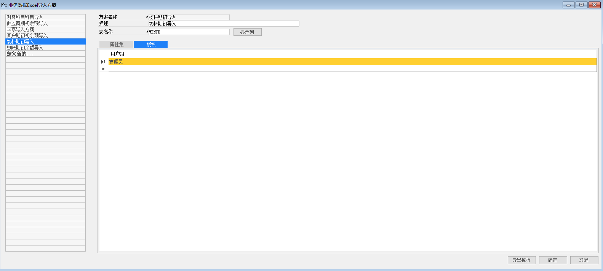
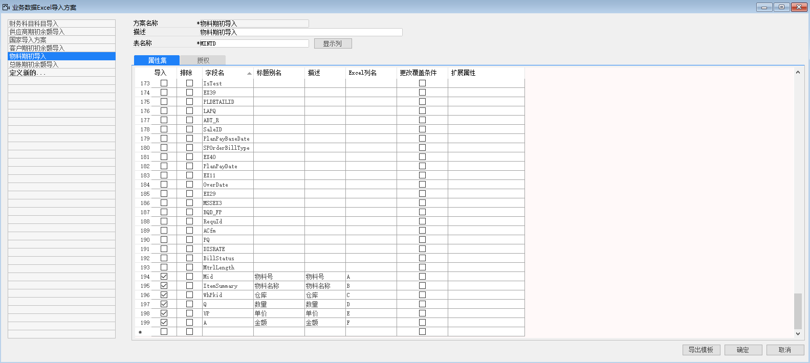
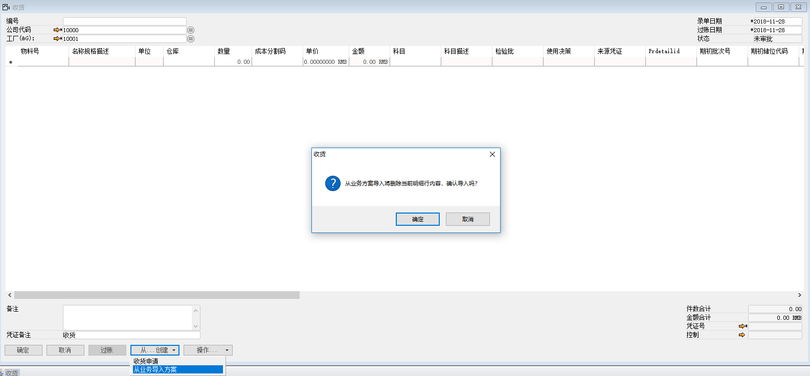
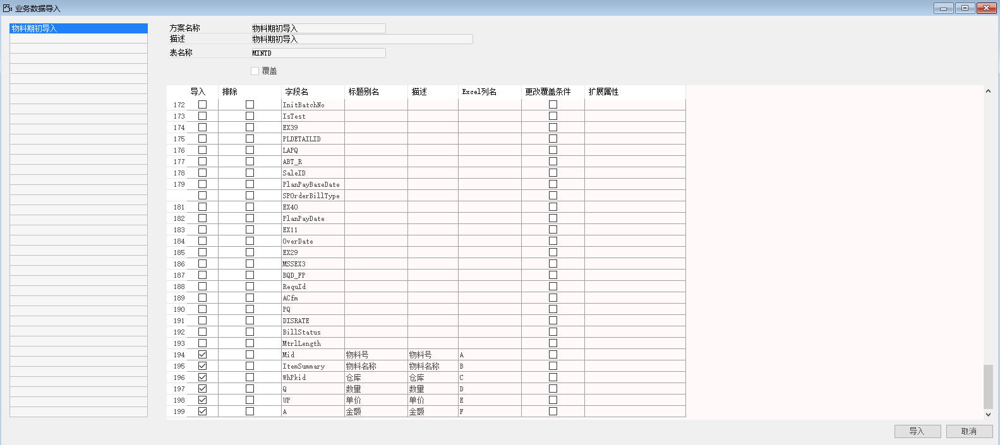
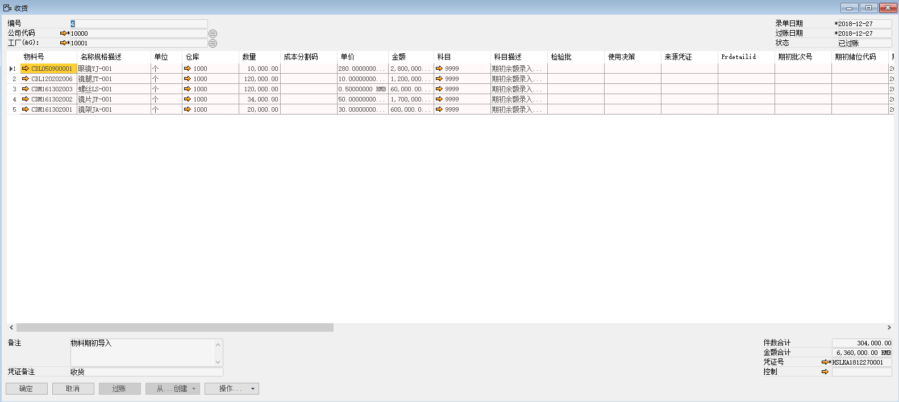
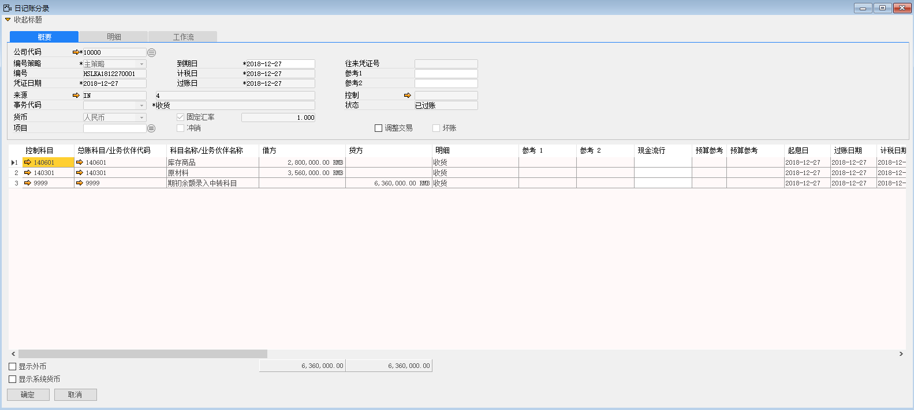

#### **概述**

本章主要讲解如何运用系统导入功能，将物料期初导入到系统中。

#### **步骤**

例如：对苏州好视力眼镜有限公司物料期初进行录入，步骤如下：

**一、 定义业务导入方案**

1、 打开路径：从菜单窗口，管理-数据导入-定义业务数据导入方案；

2、 左击‘定义新的…’按钮，编辑方案代码，名称，输入数据库表名称：MINTD，左击‘显示列’；

- 方案名称：物料期初导入

- 描述：物料期初导入

- 表名称：MINTD

3、 勾选要导入的数据，编辑别名，描述，输入对应的Excel列，以及是否需要更改覆盖条件；

4、 左击‘添加’保存;

5、 在授权页签下，将权限分配给管理员；

 

6、 左击‘导出模板’按钮将模板导出，将导出的模板进行物料期初的整理（模板见EXCEL物料期初）；

 

**二、 业务数据导入**

1、 打开路径：从菜单窗口，库存->收货，打开收货界面；

2、 左击‘从创建’按钮，左击‘从业务导入方案’，提示：‘从业务方案导入将删除当前明细行内容，确认导入吗？’左击‘确定’按钮，跳转到定义业务导入方案页面；

3、 左击‘物料期初导入’按钮，左击‘导入’按钮，在计算机本地选择整理好的物料期初模板，并确定是否覆盖或追加系统中的记录，左击‘打开’，开始导入（模板见EXCEL物料期初）。

 

 

4、 导入成功后，会形成一张所有导入物料得一般收货单在备注输入‘物料期初导入’，并在每一行明细行科目字段下添加科目 9999-期初余额录入中转科目，完善完成，左击‘添加’按钮，进行保存，并发起审批，审批通过后，左击‘过账’按钮进行过账产生财务凭证。

注:①根据字段名在数据库表中是不是主键来确定是否需要更改覆盖条件，如果是主键则需要更改覆盖条件，反之不需；

②一般物料期初导入的一般收货单过账日期应该为上线开始日期前一个月，财务月结完毕当月最后一天的日期。