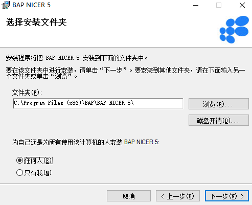
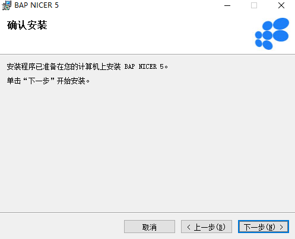
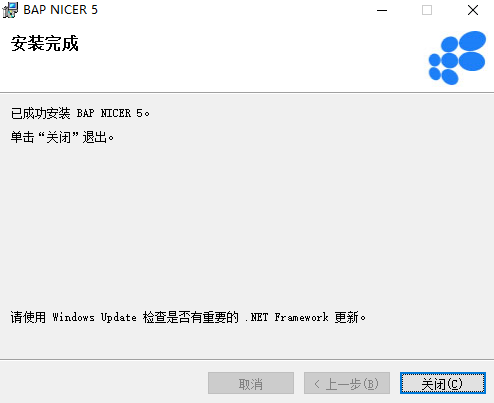

#### **概述**

本章主要讲解客户端的安装步骤。

#### **步骤**

1、 双击打开BAP NICER 5安装包或右击BAP NICER 5安装包进入到安装向导，点击‘下一步’；

 

2、 选择BAP NICER 5安装路径和安装方式，选择完成点击‘下一步’；

 

3、 确认是否安装BAP NICER 5，确认安装点击‘下一步’，开始安装BAP NICER 5，安装完成点击‘关闭’退出。

 

 

注：运行BAP NICER 5需要以管理员身份运行，操作步骤：右击BAP NICER 5程序，左击‘属性’按钮，设置以管理员身份运行此软件。