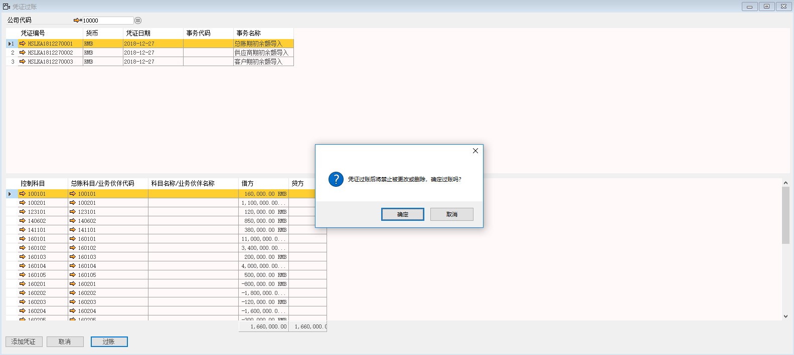
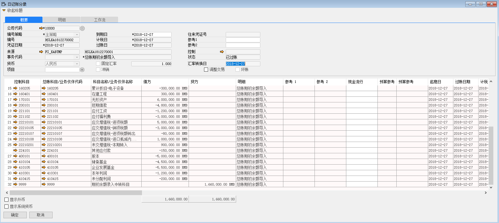
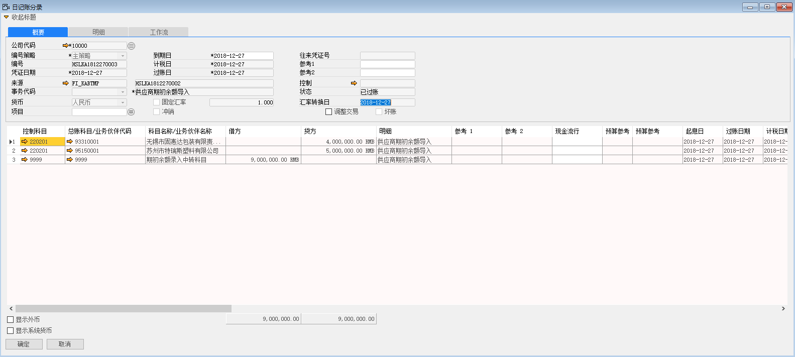
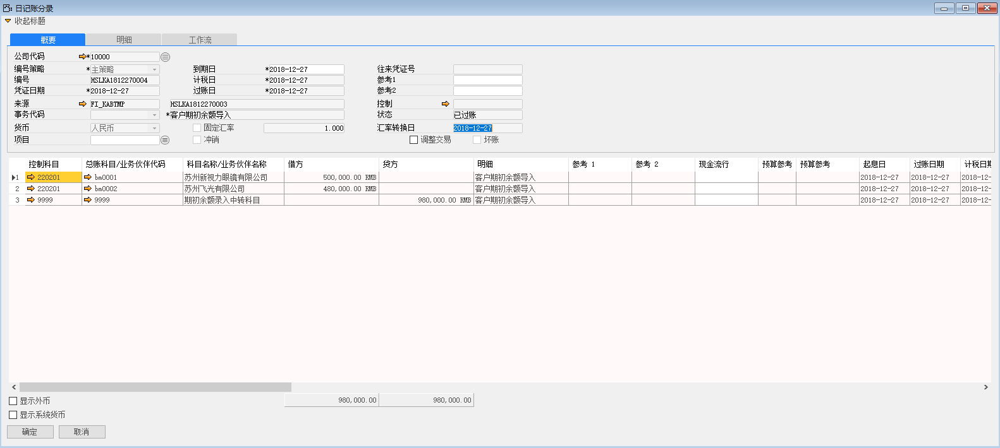
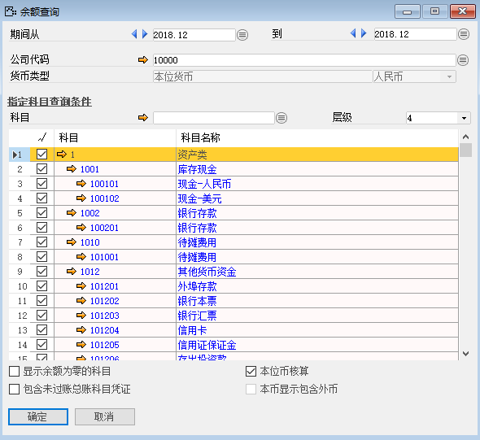

#### **概述**

上述教程第十六、十七、十八、十九中讲述如何导入财务总账期初余额、供应商期初余额、客户期初余额，本章主要讲解这些期初动态数据导入完成标志。

#### **步骤**

1、 打开路径：从菜单窗口，总账 –凭证过账，进入到过账界面；

2、 选中需要过账的凭证，左击‘过账’按钮，系统提示‘凭证过账后将禁止被更改或删除，确认过账吗？’左击‘确定’按钮进行过账；

3、 将上述教材的财务总账期初余额、供应商期初余额、客户期初余额全部进行过账，并产生对应的日记账分录。

 

 

4、 打开路径：从菜单窗口，总账 –会计报表-科目余额表，进入到科目余额表筛选界面；

 

5、 科目层级选4层，勾选所有科目，左击‘确认’按钮进入到科目余额表界面，本界面可以看到我们之前导入的科目余额，并且科目9999-期初余额录入中转科目科目余额为0，标志着我们期初动态数据导入成功且正确。
