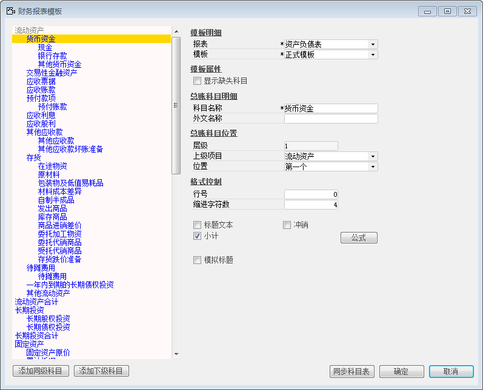
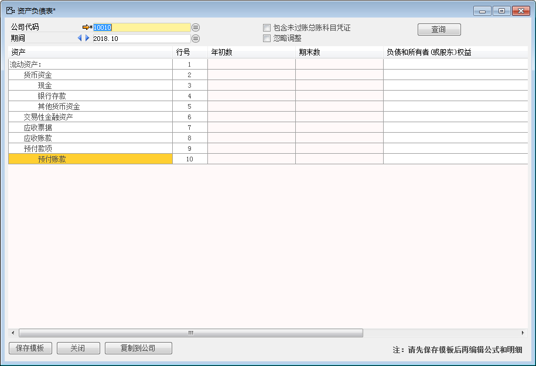
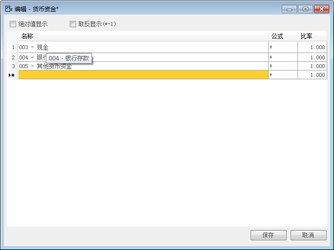
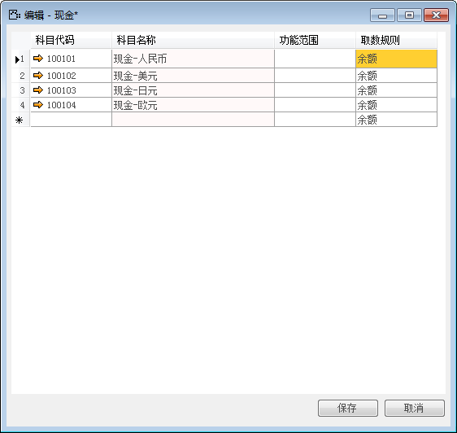

#### **概述**

财务报表出于不同的目的提供给不同的当事人，要求定制格式，使用该功能创建财务报表模板，并且不在科目表中进行任何更改。您可以创建以下报表的模板：资产负债表、利润表、现金流量表。

#### **步骤**

**资产负债表****配置**

资产负债表表示企业在一定日期（通常为各会计期末）的财务状况（即资产、负债和业主权益的状况）的主要会计报表。该报表使用报表模板显示截止到特定日期的公司累计资产和负债：“总资产总值=总债务总值+权益总值”。资产负债表是财务必要报表之一。

例如：某公司有代码为10010在2018年11份查看公司累计资产和负债的情况。实现所述的的资产负债表的配置？需要以下步骤：

1、 打开BAP  NICER 5主菜单中选择【总账】->【财务报表】->【中国】->【资产负债表】，打开资产负债表窗口；

2、 选择公司代码，选择期间，制作报表模板参考“财务报表模板”；

l 打开主菜单中选择【总账】->【财务报表模板】并选择资产负债表；

 

l 选择【公司代码】，选择【期间】；

l 参考“财务报表模板”输入内容；

 

l 参考“财务报表模板”中公式，对科目进行编辑公式，进行如下操作：

1) 表中科目有下级编辑公式项；

操作：比如右击【货币资金】->选中【编辑公式项-】>选择科目->点击【保存】按钮；

 

2) 表中科目没有下级编辑公式项；

操作：比如右击【现金】->选中【编辑明细项】->选择科目->保存;

 

3、 保存模板；

4、 最终效果图如下：

