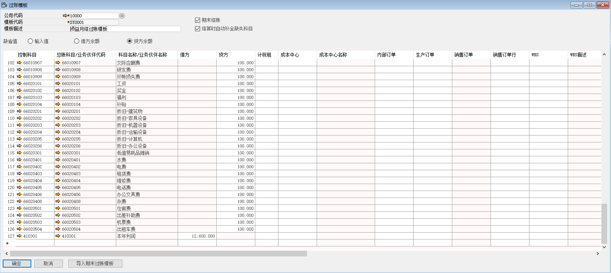

#### **概述**

本章主要讲解如何在系统内定义过账模板。

#### **步骤**

例如：创建一个苏州好视力眼镜有限公司的损益月结过账模板，步骤如下：

1、 打开路径：从菜单窗口，总账-过账模板；

2、 将模板代码、模板描述信息填写完整；

- 模板代码：SY0001

- 模板描述：损益月结过账模板

- 勾选：期末结账

- 勾选：结算时自动补全缺失科目

- 勾选缺省值：贷方余额

3、 左击‘导入期末过账模板’按钮，系统自动跳出成本类和损益类科目，并且所有科目贷方金额为100；（在期末结账时系统会自动获取科目实际余额）

4、 在科目最下方选择科目：410301-本年利润，并左击此科目借方，系统自动算出借方汇总金额；

5、 左击‘添加’按钮，进行保存。

