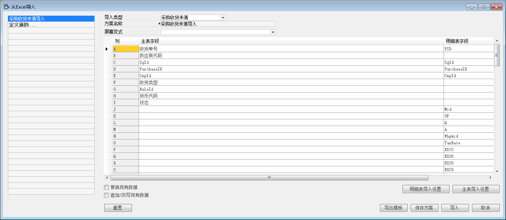
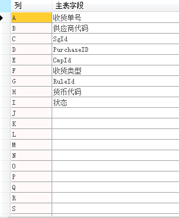
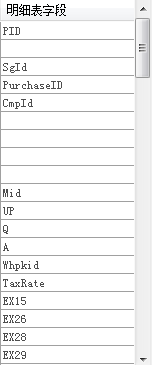
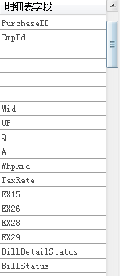
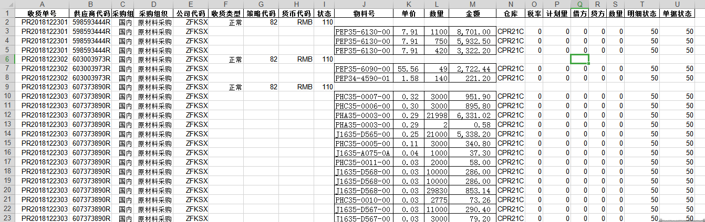
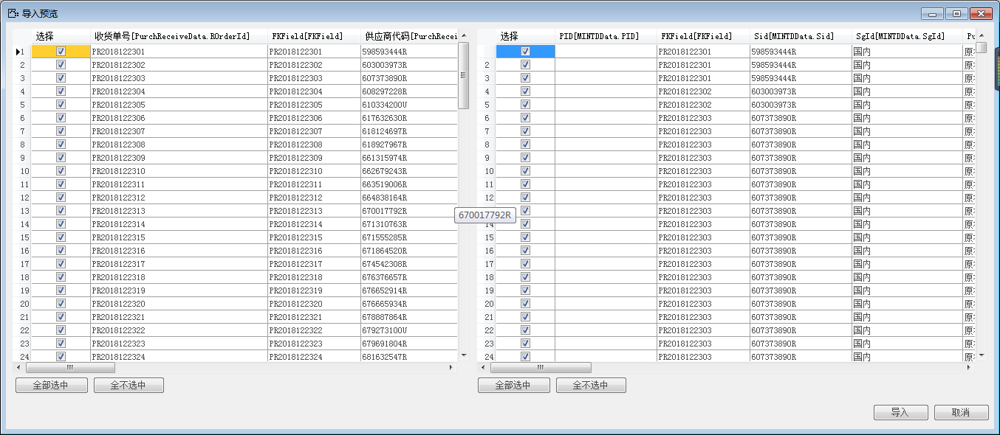
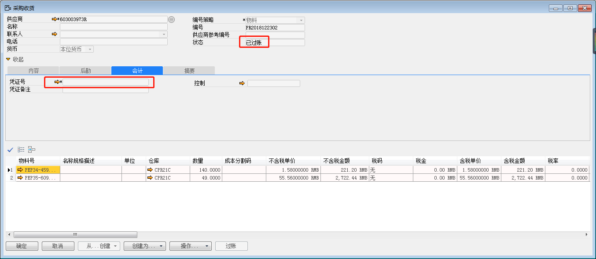
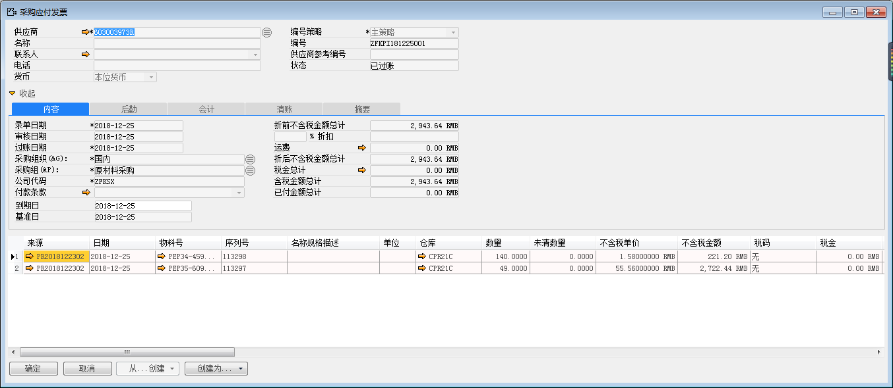
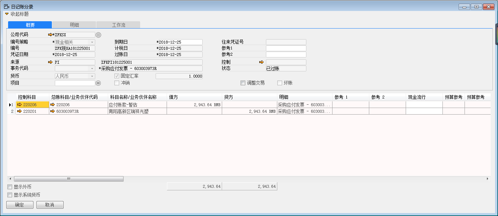

#### **概述**

在正式功能演示之前对采购收（退）货未清数据导入模版进行讲解，对于部分关键字段进行说明。从理论角度切入，有助于提高理解力，进一步为功能演示打下夯实的理论基础。

1. 导入模版（主表、明细表）

 

 

2. 导入模版（Excel表）

 

3. 字段讲解（主表）

①　SgId：采购组织代码

②　PurchaseID：采购组织代码

③　CmpId：公司代码

④　RuleId：凭证编号策略代码

⑤　注：“收货类型”字段为中富康项目新增字段，仅供参考，切勿照搬。

4. 字段讲解（明细表）

①　PID：收货单号(需要勾选关系列)

②　SgId：采购组织代码

③　PurchaseID：采购组织代码

④　CmpId：公司代码

⑤　Mid：物料号

⑥　UP：单价

⑦　Q：数量

⑧　A：金额

⑨　Whpkid:仓库

⑩　TaxRate:税率

⑪　EX15:计划量

⑫　EX26:日记账分录借方金额

⑬　EX28:日记账分录贷方金额

⑭　EX29:日记账分录过账数量

⑮　BillDetailStatus:单据明细行状态

⑯　BillStatus:单据状态

5. 导入EXCEL编写

①　A：收货单号可以不同于凭证策略编号自行导入。

②　B：供应商代码系统中必须存在。

③　C：采购组可以填中文，但系统中必须存在。

④　D：采购组织同上。

⑤　E：公司代码系统中必须存在。

⑥　F：中富康项目新增字段。

⑦　G：策略代码为凭证编号策略代码，导入时如果不确定可以在本机先行创建单据进行测试，使用数据库查询MINTD表中的RuleId即可。

⑧　H：货币代码系统中必须存在。

⑨　I：单据状态为110（已过账，采购收（退）货未清导入不能产生财务凭证）

⑩　J：物料号系统中必须存在。

⑪　K：单价。

⑫　L：数量。

⑬　M：金额。

⑭　N：仓库（日后可能会有改进，目前Whpkid可以支持直接导入仓库代码）。

⑮　O：税率。

⑯　P：计划量。（生产收发货可能会用到，这里一般是0）

⑰　Q：日记账分录借方，不过账，不产生财务凭证，一般是0。

⑱　R：日记账分录贷方，不过账，不产生财务凭证，一般是0。

⑲　S：日记账分录过账数量，不过账，不产生财务凭证，一般是0。

⑳　T：单据明细行状态，一般是50，已批准。

21　U：单据状态，一般是50，已批准。

#### **步骤**

1. 管理→数据导入→从Excel导入

 

2. 创建导入方案

 

3. 创建导入Excel

 

4. 导入预览

 

5. 找到其中一张收货单，已过账，并没有产生财务凭证。

 

6. 创建应付发票并测试，查看日记账分录，核对正确。

 

 

注：采购退货未清导入基本与上述过程相同。