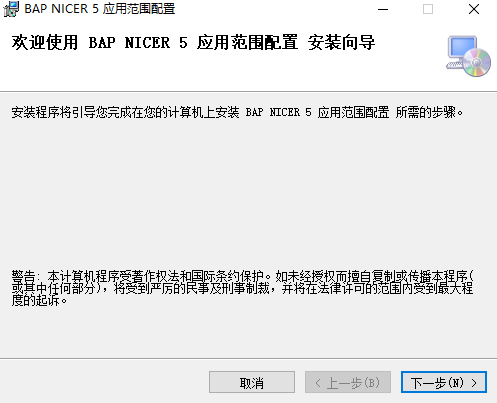
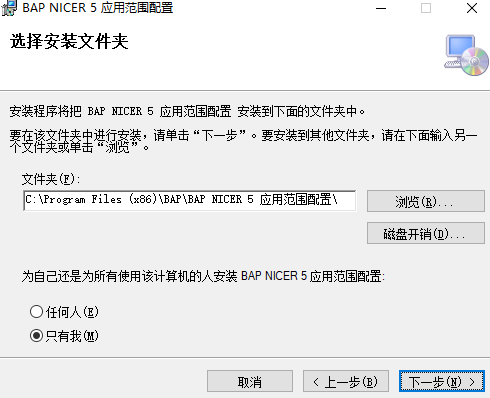
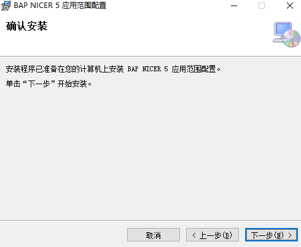
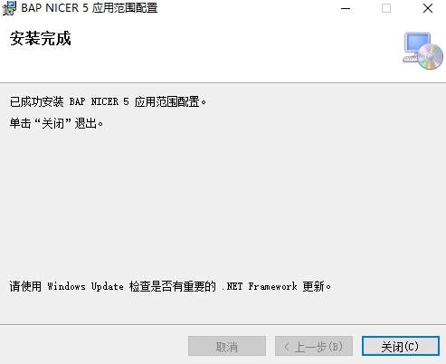

#### **概述**

本章主要讲解应用范围配置的安装步骤。

#### **步骤**

1、 双击打开BAP NICER 5 应用范围配置安装包或右击BAP NICER 5 应用范围配置安装包进入到安装向导，点击‘下一步’；

 

2、 选择BAP NICER 5应用范围配置安装路径和安装方式，选择完成点击‘下一步’；

 

3、确认是否安装BAP NICER 5，确认安装点击‘下一步’，开始安装BAP NICER 5，安装完成点击‘关闭’退出。

 
