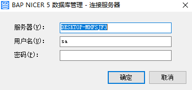
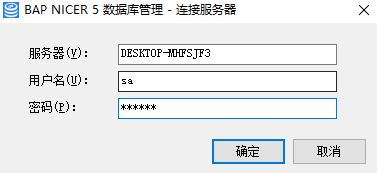
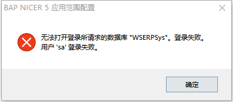
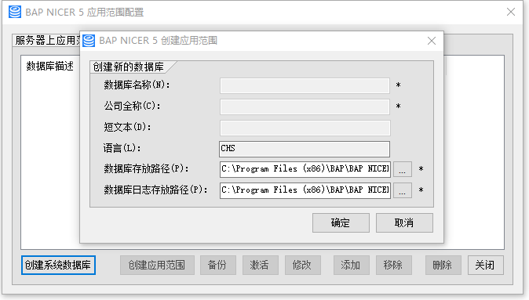
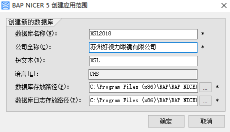

创建

#### **概述**

本章主要讲解应用范围配置的创建步骤。

#### **步骤**

1、  双击打开BAP NICER 5 应用范围配置或右击BAP NICER 5 应用范围配置进入到登录界面；

 

2、 在登录界面依次输入数据库服务器名称(或者IP地址)、数据库用户名、数据库用户密码，如下图所示，然后点击‘确定’按钮；

 

3、 注意：首次登录时，BAP NICER 5会出现对话框提示，请左击‘确定’按钮，该信息表示服务器尚未配置过BAP NICER 5；

 

4、 在BAP NICER 5应用范围配置主界面，左击‘创建系统数据库’按钮，您可以选择数据库存放路径，也可以选择默认路径，左击‘确定’按钮；

5、 系统数据库创建成功后，‘创建系统数据库’按钮就被系统禁用了，‘创建应用范围’按钮被允许使用了；

6、左击‘创建应用范围’按钮，在应用范围编辑窗口依次输入数据库名称、公司全称、短文本，您可以使用系统推荐的数据库存放路径和日志存放路径，您也可以选择其它存放路径，左击‘确定’按钮，等待系统创建完成；

 

管理

#### **概述**

本章主要讲解如何管理应用范围配置。

#### **步骤**

- 第一次创建应用范围时，打开BAP NICER 5数据库管理器，首先需要创建系统数据库，左击‘创建系统数据库’按钮即可。

- 备份：可以对列表中的数据库进行备份操作，功能和在SQL Server数据库中对数据进行备份是一样的。

- 激活\停用：在创建应用范围结束后，默认为激活状态即可用于BAP NICER 5的数据载体，如果停用某个应用范围，选中应用范围左击‘停用’即可。

- 修改：可以对创建的应用范围的公司名称等进行修改。

- 添加：可以将SQL Server中的数据库快速定义为系统可用的应用范围。

- 移除：将应用范围从列表中移除，但数据库中仍存在该数据库。

- 删除：将数据库删除，在进行删除操作前数据库管理器会强制进行数据备份。

- 关闭：关闭BAP NICER 5数据库管理器。