#### **概述**

本章主要讲解创建登录配置及部署内核服务管理器的步骤。

#### **步骤**

创建登录配置

1、 双击打开BAP NICER 5客户端或右击BAP NICER 5客户端进入到选择服务器界面，点击‘增加’进入配置界面；

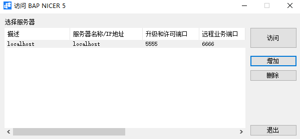 

2、 依次输入配置变量参数，如下图所示，然后点击【Save】按钮；

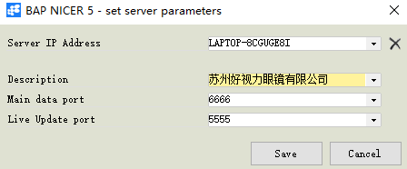 

3、 选中刚才创建的应用范围，点击【访问】按钮；

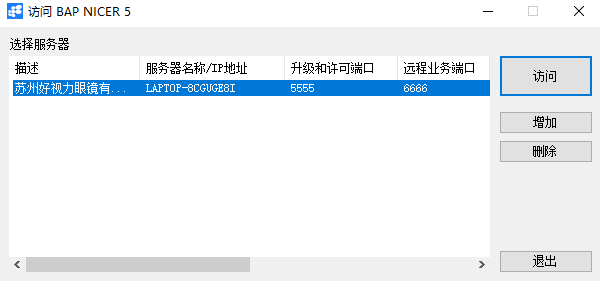 

4、 系统跳出BAP NICER 5 Live Update 界面，左击‘RUN’按钮系统跳出提示界面，左击‘是’按钮，进入选择应用范围界面；

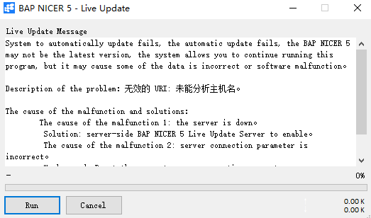 

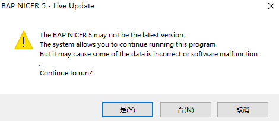 

5、 左击‘取消’按钮，系统进入登录界面；

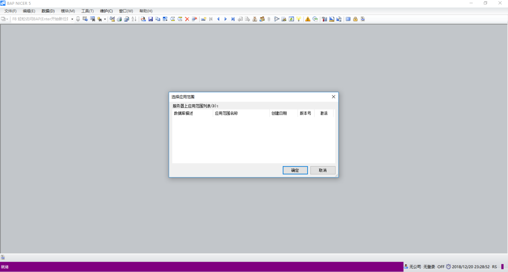

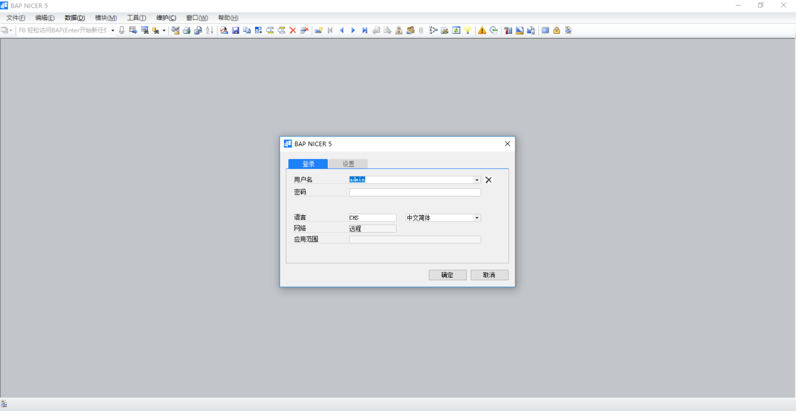

6、 在系统登录界面，选择设置页签，勾选连接到本地服务器，左击‘选择应用范围’按钮，系统提示‘用户登录失败’左击‘确认’按钮进入到选择应用范围界面；

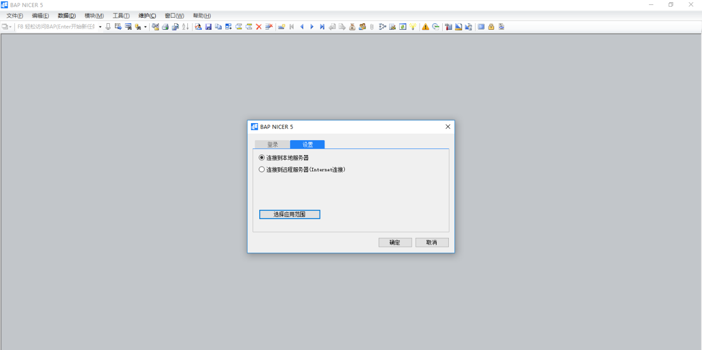

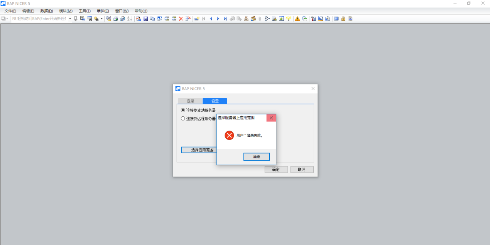

7、 在系统界面输入相应的服务器、数据库用户名、数据库密码，左击‘刷新’按钮，会跳出服务器上应用范围列表；

- 服务器：localhost

- 数据库用户名：sa

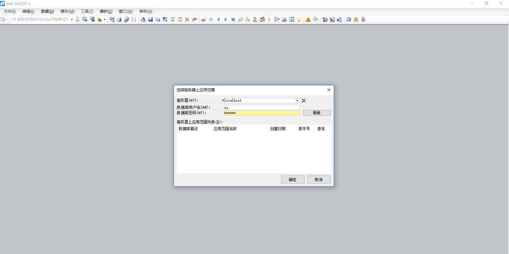 

8、 选中苏州好视力眼镜有限公司应用范围，左击‘确定’按钮；

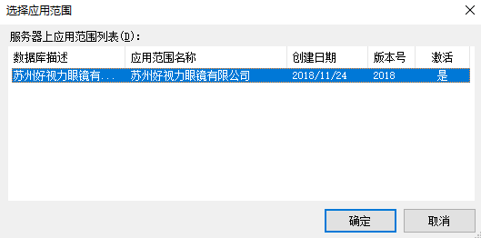 

9、 选择登录选项卡，输入用户名:admin，密码：空，点击【确定】按钮，进行登录；

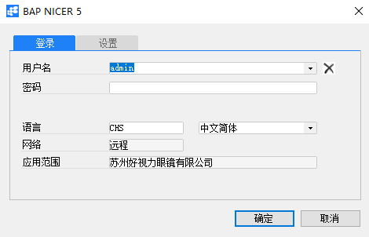

10、 打开路径：维护-导出登录配置；

左击导出登录配置进入到导出登录配置界面，左击‘导出’按钮进行导出登录配置，选择文件存放路径；

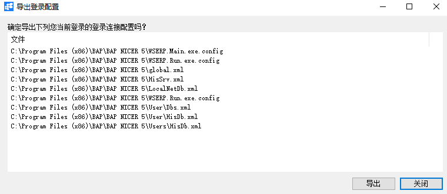 

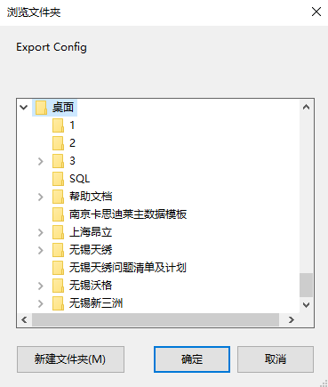 

11、 将导出的文件复制到其他计算机上，双击打开BAP NICER 5升级或右击BAP NICER 5升级进入到BAP NICER 5 Client Upgrade;

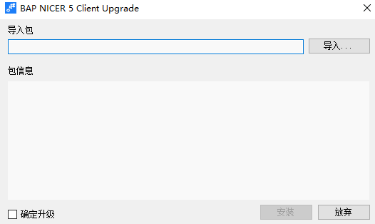 

12、 左击‘导入’按钮，选中导出的登录配置文件，勾选‘确定升级’按钮，左击‘安装’按钮进行安装；

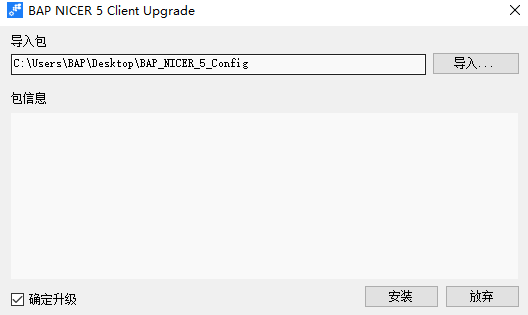 

13、 系统提示本次升级安装已经完成，左击‘完成’按钮，登录配置操作完成。

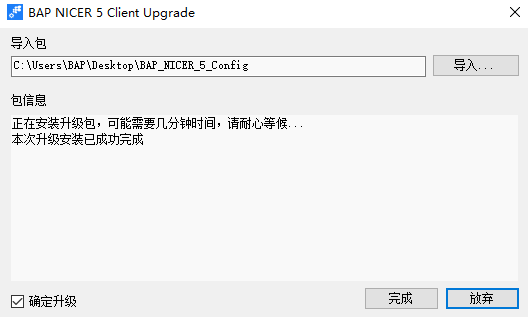 

部署内核服务管理器

1、 双击打开BAP NICER 5内核服务管理器或右击BAP NICER 5内核服务管理器，此时桌面没有 BAP NICER 5内核服务管理器窗口；

2、 双击或右击电脑任务栏下的BAP NICER 5内核服务管理器图标,打开BAP NICER 5内核服务管理器界面；

3、 左击打开参数&数据库界面，将主程序数据传输端口号、Live Update 数据传输端口号、数据库服务器名、数据库用户名、数据库密码填写完整，并且左击‘更新’按钮；

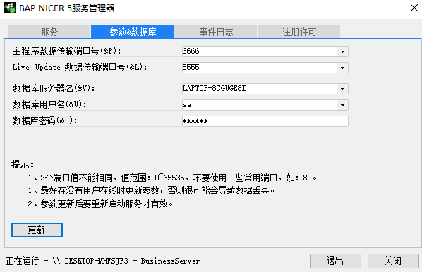 

4、 在【服务】下将BAP NICER 5系统的四种服务左击‘开始/继续’启动；

- AutoDataExchangeService：数据自动交换服务

- BusinessServer：业务服务

- LiveUpdateServer:在线更新服务

- TaskPlanService：任务执行计划服务

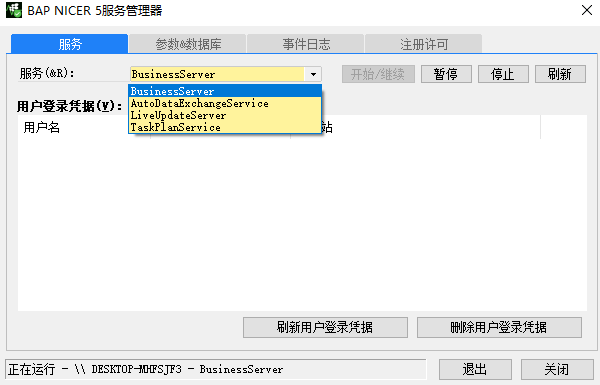 

激活

#### **概述**

本章主要讲解如何激活内核服务管理器。

#### **步骤**

1、 双击打开BAP NICER 5内核服务管理器或右击BAP NICER 5内核服务管理器，此时桌面没有 BAP NICER 5内核服务管理器窗口；

2、 双击或右击电脑任务栏下的BAP NICER 5内核服务管理器图标,打开BAP NICER 5内核服务管理器界面；

3、 在【注册许可】下，将申请号复制发给软件供应商或技术中心，从服务商获取授权许可号；

4、 将收到的授权许可号，复制到【注册许可】下的授权许可号空白处，点击注册，激活完成。

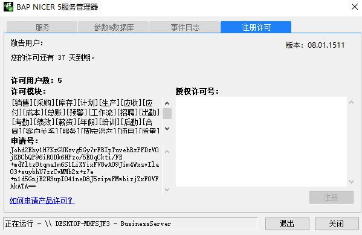