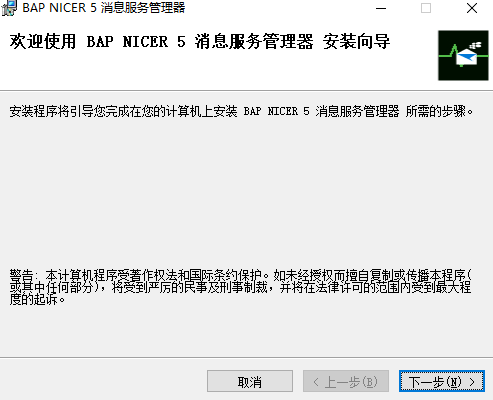
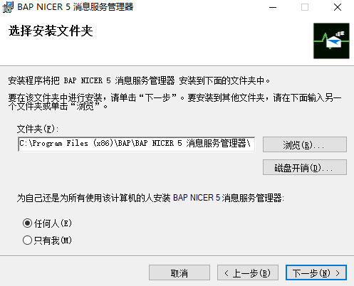
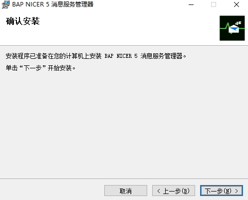
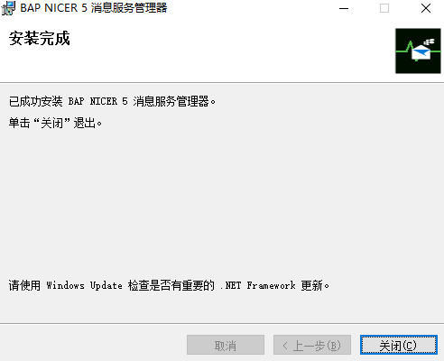
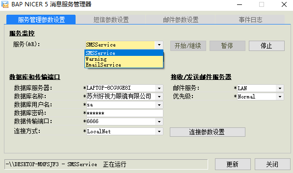

安装消息服务管理器

#### **概述**

本章主要讲解消息服务管理器的安装步骤。

#### **步骤**

1、 双击打开BAP NICER 5 消息服务管理器安装包或右击BAP NICER 5 消息服务管理器安装包进入到安装向导，点击‘下一步’；

 

2、 选择BAP NICER 5 消息服务管理器安装路径和安装方式，选择完成点击‘下一步’；

 

3、 确认是否安装BAP NICER 5 消息服务管理器，确认安装点击‘下一步’，开始安装BAP NICER 5 消息服务管理器，安装完成点击‘关闭’退出。

 

 

配置消息服务管理器

#### **概述**

本章主要讲解如何配置消息服务管理器。

#### **步骤**

1、 双击打开BAP NICER 5消息服务管理器或右击BAP NICER 5消息服务管理器，此时桌面没有 BAP NICER 5消息服务管理器窗口；

2、 双击或右击电脑任务栏下的BAP NICER 5消息服务管理器图标,打开BAP NICER 5消息服务管理器界面；

3、  在【服务】下将BAP NICER 5系统的三种服务左击‘开始/继续’启动；

SMSService：消息服务

Warning:预警服务

EmailService：邮件服务

4、 将数据库服务器、数据库名称、数据库用户名、数据库密码、数据传输端口、连接方式填写完善并左击‘更新按钮’；

