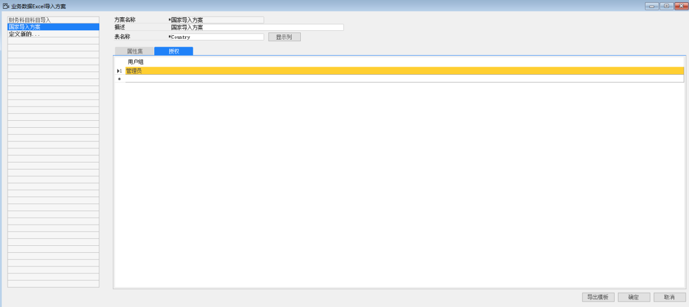
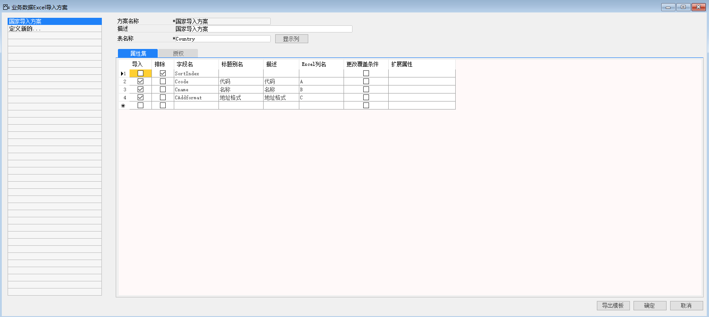

#### **概述**

业务数据导入方案是根据数据库中的表字段来自定义导入哪些数据，适用范围广。

#### **步骤**

例如：创建国家的业务导入方案，步骤如下：

1、 打开路径：从菜单窗口，管理-数据导入-定义业务数据导入方案；

2、 左击‘定义新的…’按钮，编辑方案代码，名称，输入数据库表名称：Country，左击‘显示列’；

- 方案名称：国家导入方案

- 描述：国家导入方案

- 表名称：Country

3、 勾选要导入的数据，编辑别名，描述，输入对应的Excel列，以及是否需要更改覆盖条件；

4、 在授权页签下，将权限分配给管理员；

 

5、 左击‘添加’保存

