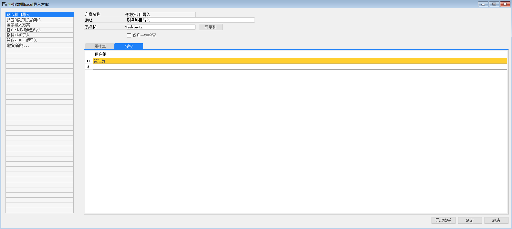
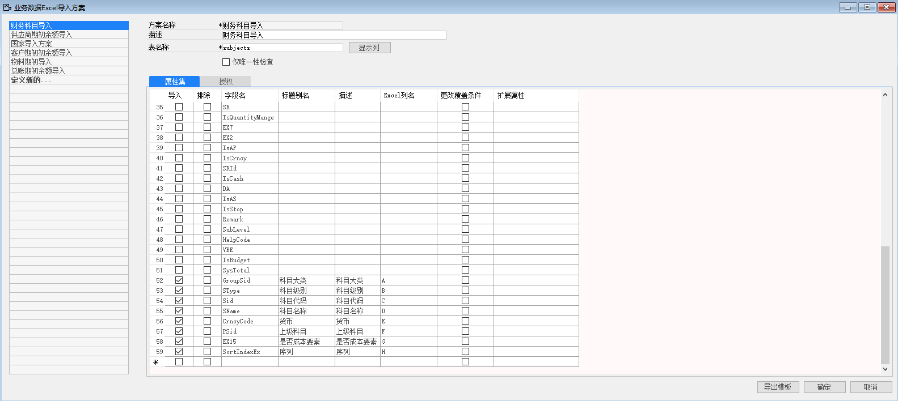
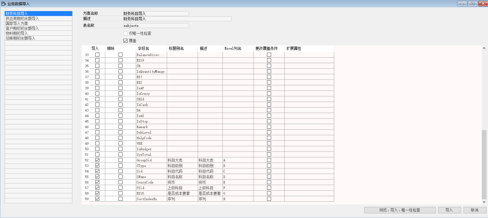
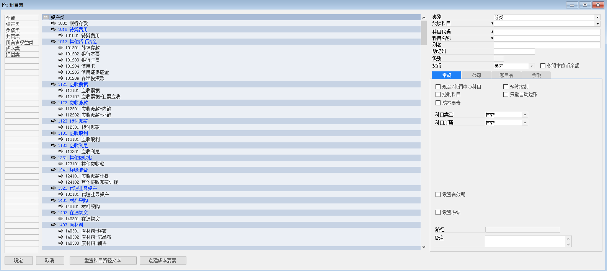

#### **概述**

本章主要讲解如何运用系统导入功能，将客户财务科目导入到系统中。

#### **步骤**

例如：对苏州好视力眼镜有限公司财务科目进行录入，步骤如下：

一、  **定义业务导入方案**

1、 打开路径：从菜单窗口，管理-数据导入-定义业务数据导入方案；

2、  左击‘定义新的…’按钮，编辑方案代码，名称，输入数据库表名称：Subjects，左击‘显示列’；

- 方案名称：财务科目导入

- 描述：财务科目导入

- 表名称：Subjects 

3、 勾选要导入的数据，编辑别名，描述，输入对应的Excel列，以及是否需要更改覆盖条件；

| 字段名 | 标题别名 |  描述 | EXCEL列名 |
| ---- | ---- | ---- |
| Groupsid | 科目大类 |  科目大类 | A |
| SType | 科目级别 |  科目级别 | B |
| Sid  | 科目代码 |  科目代码 | C |
| SName | 科目名称 |  科目名称 | D |
| CrncyCode | 货币 |  货币 | E |
| PSid | 上级科目 |  上级科目 | F |
| EX15 | 是否成本要素 |  是否成本要素 | G |
| SortIndexEx | 序列 |  序列 | H |

4、 左击‘添加’保存;

5、 在授权页签下，将权限分配给管理员；

6、 左击‘导出模板’按钮将模板导出，将导出的模板进行财务科目的整理（模板见EXCEL财务科目）；

 

二、 **业务数据导入**

1、 打开路径：从菜单窗口，管理->数据导入->业务数据导入，打开导入界面；

2、 选择业务数据导入方案，并确定是否覆盖或追加系统中的记录；

3、 左击‘预览、导入、唯一性检查’，在计算机本地选择整理好的财务科目模板（模板见EXCEL财务科目），并确定是否覆盖或追加系统中的记录，左击‘打开’，左击‘全选’，开始导入，导入完成可在总账-科目表里面查看导入的财务科目；

4、 打开路径：从菜单窗口，管理->系统初始化->定义会计账目表，打开界面；

5、 左击按钮，找到会计账目表，左击‘分配科目’按钮，系统跳出提示‘确认将总账科目全部分配给该账目表吗’，左击‘确认’按钮，进行分配，分配完成，导入的财务科目就可以被引用。

注:根据字段名在数据库表中是不是主键来确定是否需要更改覆盖条件，如果是主键则需要更改覆盖条件，反之不需