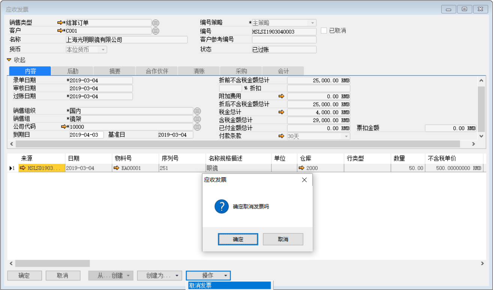
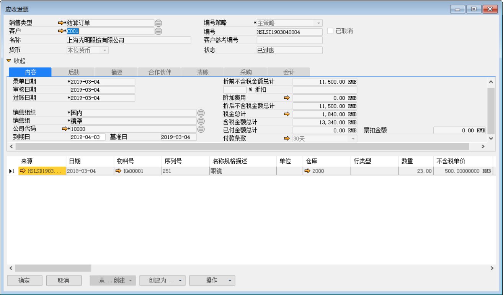
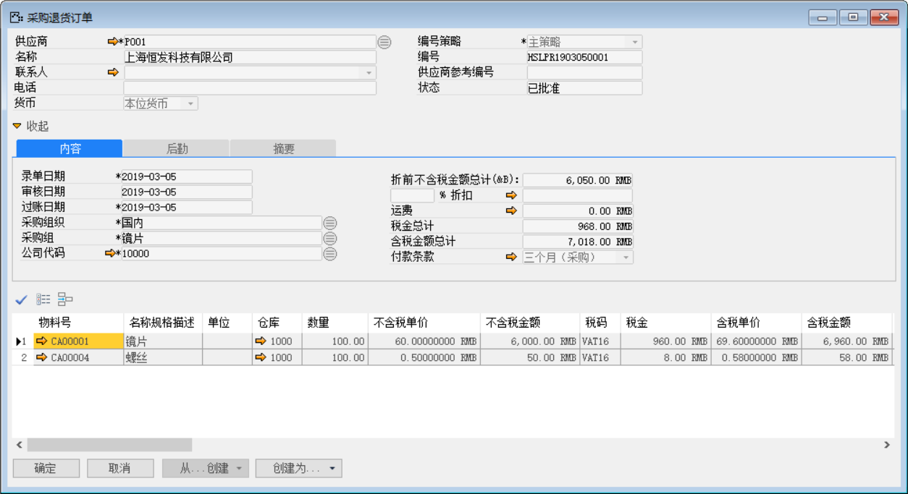
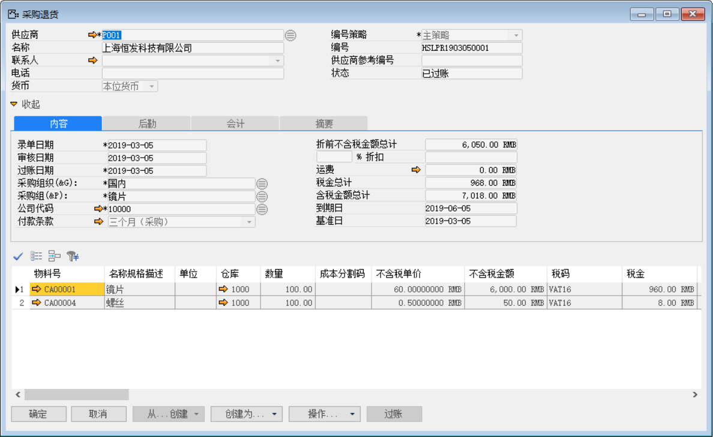
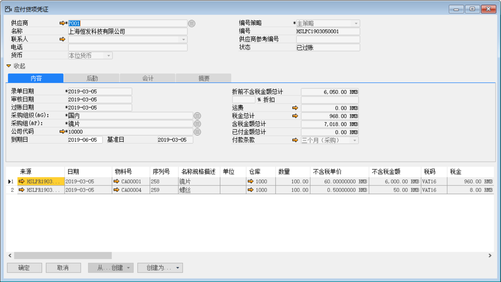
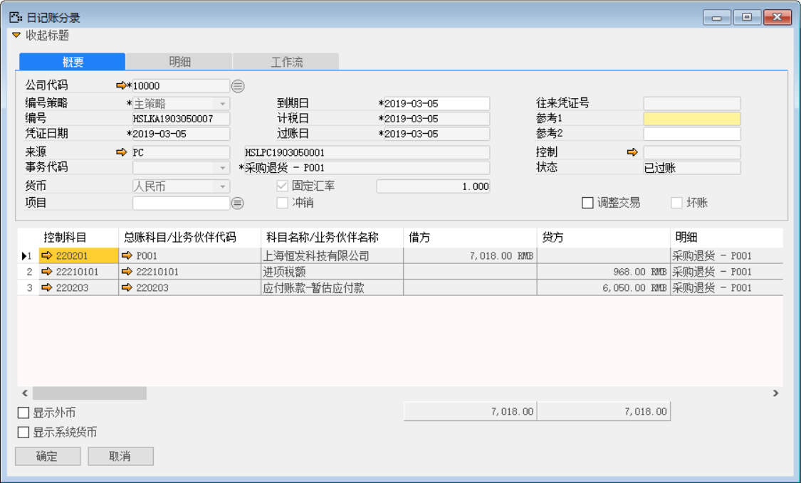
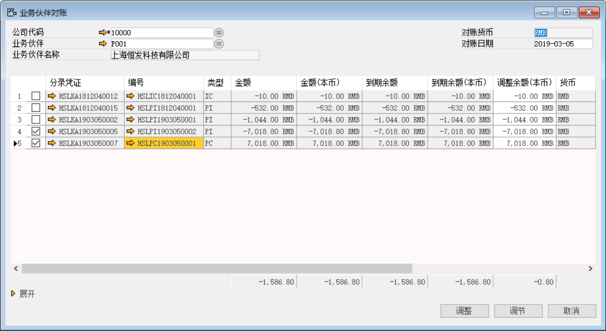

BAP ERP系统中业务发票是业务流程当中必不可少的一环，但是我在录入发票是总会有录入数据错误等一系列问题的时候，当然录入的发票状态还未审批时我可以及时的修改内容，那已经审批过账的时候呢？那么下面我将介绍BAP ERP系统中发票过账错误时如何调整。

#### **应收发票过账后错误处理**

例：某公司财务部门专员在ERP系统中创建了一张应收发票并且状态为已过帐，这时他发现这张因为金额问题做错了，这时他需要调整此发票。

前提：已创建销售订单、销售发货及来源于销售发货状态为已过帐的应收发票。

1、 打开【应收发票】界面，选择一张已过帐错误发票为例，点击【操作】按钮选择‘取消发票’把此应收发票取消；

打开路径：【应收账款】-【应收发票】

 

2、 重新打开【应收发票】界面，基于销售发货重新创建一张正确得应收发票保存并审批。

 

#### **应付发票过账后错误处理**

例：某公司财务部门专员在ERP系统中创建了一张应付发票并且状态为已过帐，这时他发现这张因为金额问题做错了，这时他需要调整此发票。

前提：已创建采购订单、采购收货及来源于采购收货，状态为已过帐的应付发票。

1. 打开【采购退货订单】界面，创建一张采购收货：HSLPR1903050003的采购退货订单：HSLPR1903050001各退数量100个；

- 选择与采购收货相同的供应商等基础性息；

- 保存单据并对其进行审批操作；

 

2. 打开【采购退货】界面，基于采购退货订单：HSLPR1903050001创建采购退货单：HSLPR1903050001；

打开路径：系统菜单—采购—采购退货

- 选择公司代码、供应商等基础信息；

- 点击【从…创建】从采购退货订单清单中选择采购退货订单与明细行信息；

- 保存单据并对其进行审批过账操作。

 

- 点击【会计】标签下凭证号右侧按钮，打开凭证号：HSLKA1903050001的采购退货财务凭证。

**借（Dr）：应付暂估-供应商**

**贷（Cr）：原材料**

 

3. 打开【应付贷项凭证】界面，基于采购退货：HSLPR1903050001创建应付贷项凭证：HSLPC1903050001；

打开路径：系统菜单—应付账款—应付贷项凭证

- 选择公司代码、供应商等基础信息；

- 点击【从…创建】从采购退货清单中选择采购退货单与明细行信息；

- 保存单据并对其进行审批过账操作。

 

- 点击【会计】标签下凭证号右侧按钮，打开凭证号：HSLKA1903050007的应付贷项凭证财务凭证。

**借（Dr）: 应付账款-供应商** 

**贷（Cr）:应交增值税-进项税** 

**贷（Cr）: 应付暂估-供应商**

4. 打开【内部对账】界面，对做错的应付发票冲销；

打开路径：【总账】-【内部对账】-【内部对账】

- 勾选需要冲销的应付发票和贷项凭证；

- 点击【调节】按钮进行发票冲销。

 

5. 重新按照采购流程重新创建并录入正确的采购数量与金额。