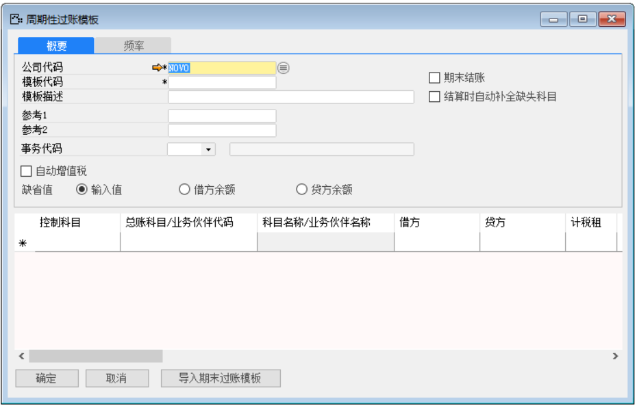
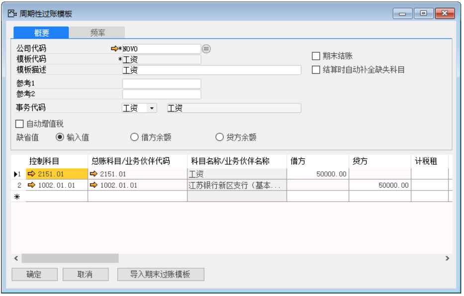
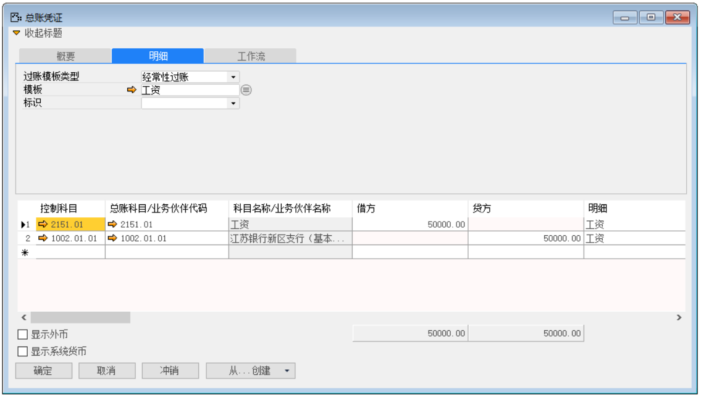
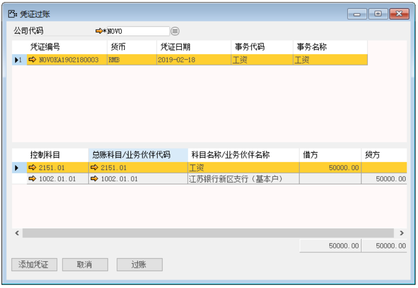
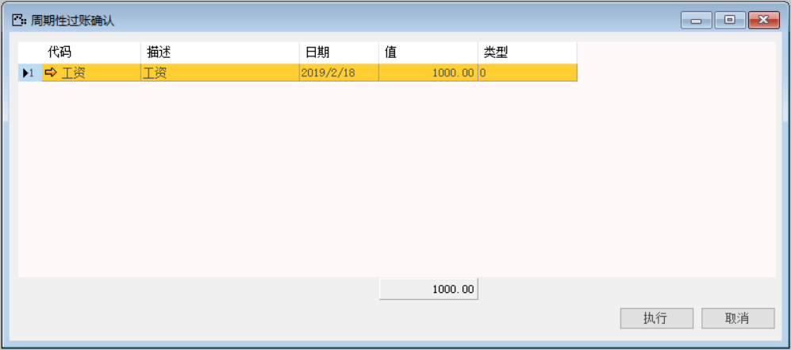

#### **一、周期性过账模板介绍**

周期性过账模板用于创建总账凭证。每个企业都有每月或每周都会重复发生的交易。交易重复发生于预定义的日期，并且通常包含相同的科目和金额。这些凭证可作为周期性总账凭证。为了方便用户操作，节省重复创建一样的总账凭证的工作量，系统开发了周期性过账模板功能。

#### **二、周期性过账模板应用**

周期性过账模板位于系统【总账】—【周期性过账模板】

1、 创建周期性过账模板：

（1）选择公司代码，填写模板代码，模板描述，缺省值等信息，勾选期末结账；

（2）缺省值选择输入值，输入总账科目，借方或贷方金额；（如果是按照科目的借贷方余额创建总账凭证，则对应选择借方余额或者贷方余额，明细栏借贷方不需要手动输入金额。）

（3）点击【频率】选项卡，设置执行的频率；

（4）单击【添加】按钮。

 

2、 创建总账凭证

（1）选择公司代码、编号策略、凭证日期、事务代码、货币等信息；

（2）点击【明细】选项卡，选择过账模板类型与模板；

（3）确认凭证内容，填写修改正确其中的信息；

（4）单击【添加】按钮 

（5）点击按钮发起审批

 

3、 凭证过账

（1）从菜单窗口，【总账】->【凭证过账】，进入凭证列表；

（2）选择公司代码、选中要过账的总账凭证行；

（3）点击【过账】，进行过账操作

 

周期性过账模板会在设置的频率触发期自动提示：在用户登录系统时，系统会自动弹出提示框。选择模板，点击【执行】按钮，系统会自动生成一张对应的总账凭证，然后在总账凭证模块找到该凭证，发起审批，最后凭证过账。

