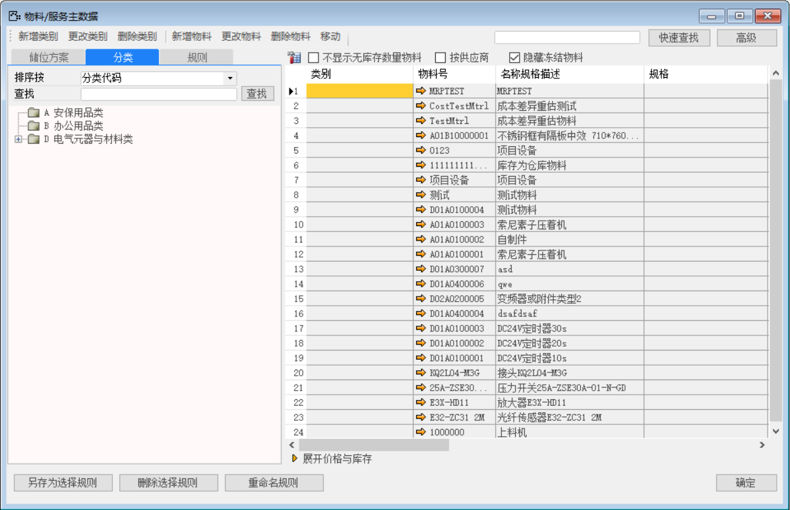
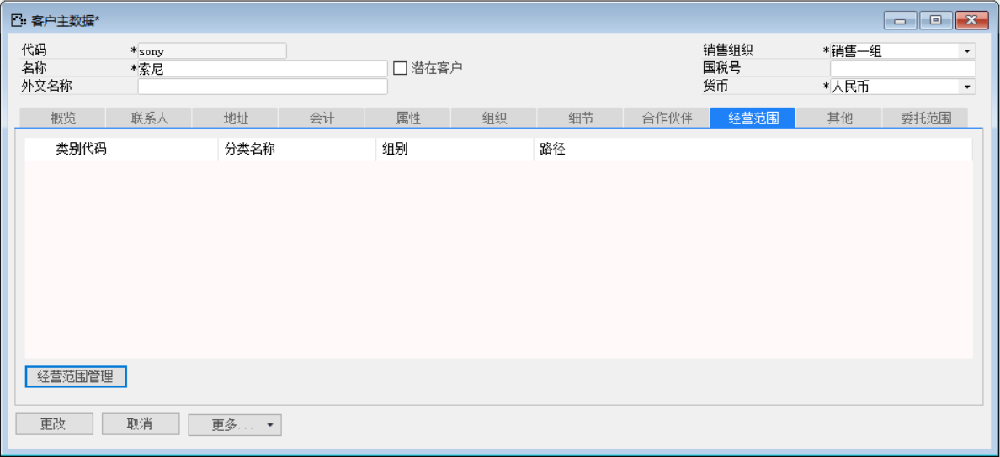
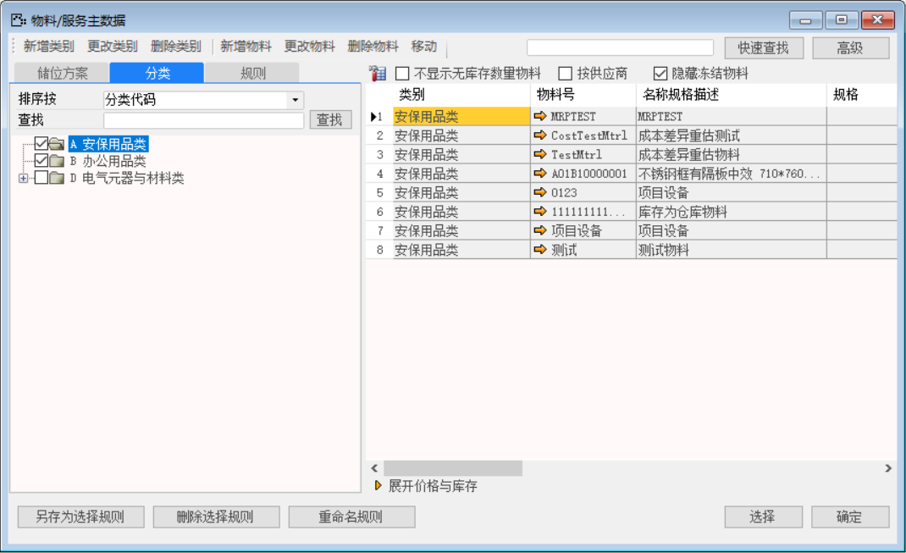
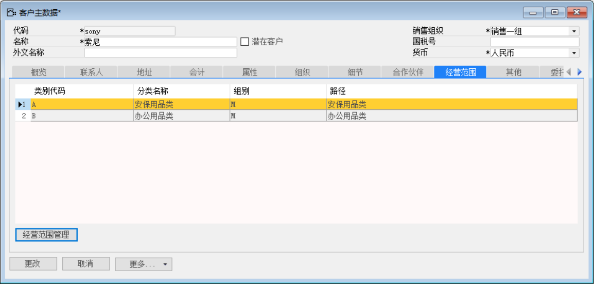
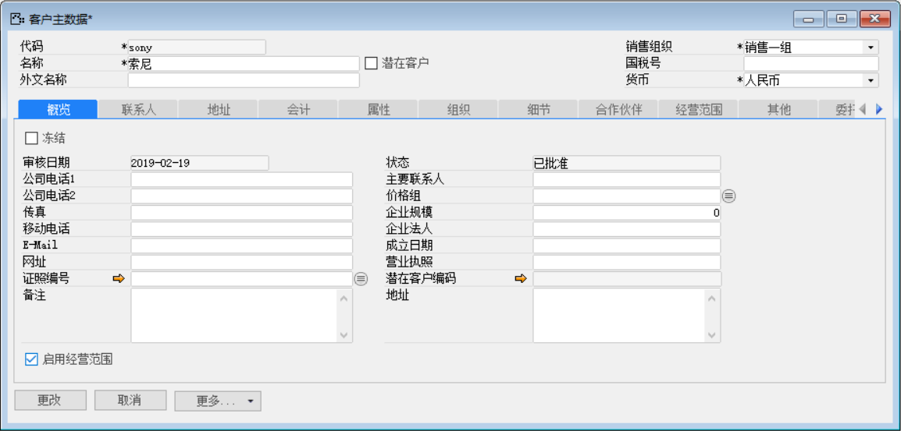
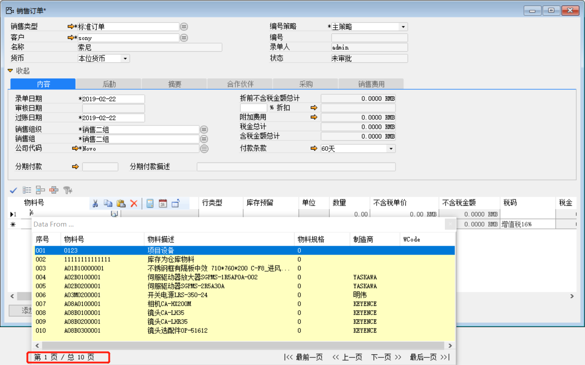
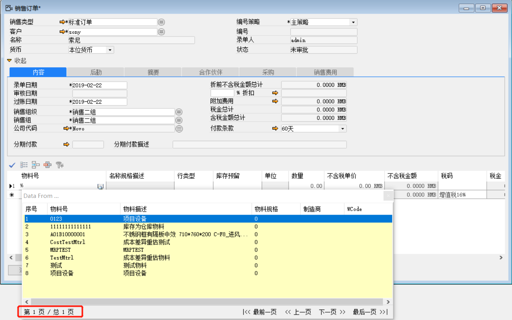

企业经营范围是指企业可以从事的生产经营与服务项目，是进行公司注册申请时的必填项。企业法人应当在核准登记的经营范围内从事经营。

BAP允许设置供应商经营范围，不在供应商经营范围内的物料，系统将拒绝物料采购凭证的创建。

*前提：【库存】-【物料分类管理】中已定义好分类并有相应物料，具体参见下图*

 

 

打开【客户主数据】，选择要设置经营范围的客户，点击选项卡【经营范围】，

 

单击下方【经营范围管理】按钮，打开【物料/服务主数据】

 

勾选属于该客户经营范围的物料分类后，点击下方【选择】按钮

 

打开【概览】选项卡，勾选【启用经营范围】

 

更改后审批该客户主数据。

启用经营范围前：该客户可用所有物料

 

启用经营范围后：对该客户创建销售订单时只能选取属于其经营范围内的物料

 