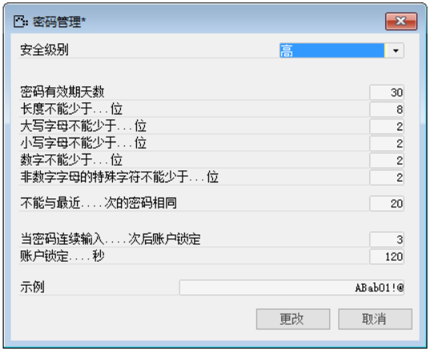
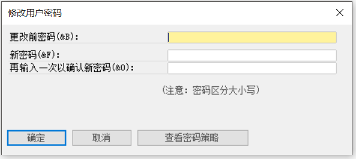
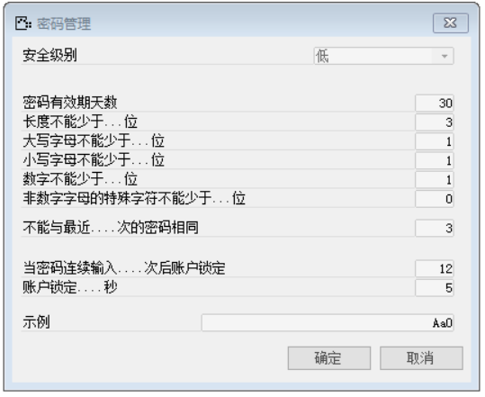
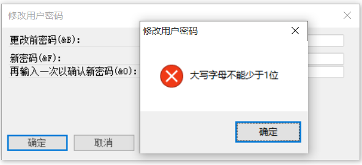

互联网给企业带来了巨大的改变,但也面临着更多的网络安全问题。公司存在高质量的数据,机密资料。而大多公司都开放了社交网络页面，存在更多可接入点，员工流动,更换增加，各种新、旧的网络安全问题一直都存在与企业。 

而密码的规范有效密码实施是防范信息泄露最基础简单有效的途径。密码设施是网络空间安全的免疫系统，密码即是免疫基因，融于信息系统的各个环节，构成密码保障体系，是网络安全保障体系的重要组成部分，起到基础和支撑作用。密码也是我们保护私密信息所设置的安全认证口令，因此需妥善保管和使用。

一般企业密码管理规定

为了防范外部入侵企业内网，规定网络接入设备的密码必须定期更换，以保证内网的安全高效：

一、 用户密码管理的范围是指办公室所有涉密计算机，服务器，网络接入设备等使用的密码。

二、网络接入的密码管理由信息中心负责人及网络管理员负责，具体操作计算机，服务器等的密码管理由使用人负责。

而不恰当的密码管理可能导致的信息泄露会给企业带来以下后果：

1、企业经济利益受损

2、企业名誉受到损害

4、影响企业内部和谐发展

5、引发企业高层的管理动荡

在数据信息的作用与地位日益显要的今天，数据信息的安全问题是关乎企业声誉、公众信任感、经济利益、生死存亡的问题，企业数据信息的安全程度将会影响企业的外部竞争力。因此一定要把最基础有效的密码管理做好。

在BAP系统中保存了大量企业信息，因此管理好BAP的用户密码也不可轻视。在BAP系统中，密码管理定义了五种安全级别：高，中，低，无和自定义。不同的级别定义了不同的密码设置要求，主要包括：密码的有效期，密码的长度，密码内大小写字母、数字特殊字符的位数，不能与最近几次密码重复，错误几次锁定以及锁定时长。各个企业可以根据自身需求选择不同的安全级别，也可以自定义一个密码设置要求。安全级别选择或者自定义完成之后，会在最下面的示例文本框内根据你的密码要求显示一段密码。确定之后就可以点击【更改】按钮保存了。

 

用户的初始密码为000，用户第一次登录系统或密码有效期到期时，系统会自动弹出对话框要求用户修改密码。当用户需要修改密码时，可以在菜单栏【文件】—【修改用户密码】

 

点击【查看密码策略】可以查看当前密码管理的安全等级和密码要求。

 

如果输入的密码不符合当前密码管理的安全级别要求，则会弹出对话框提示当前密码哪里不符合要求。

 

BAP系统中管理用户密码在【管理】—【基础定义】—【一般】—【定义用户】，在此界面中管理人员并不能看到用户密码，当有用户忘记自己密码时，管理人员可以在次界面勾选口令已失效复选框，选择之后用户的密码会变更为初始密码：000。

