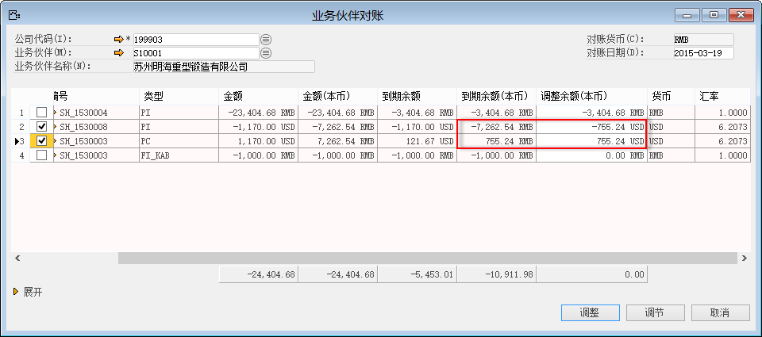
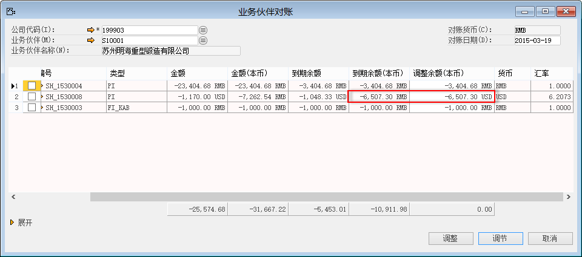
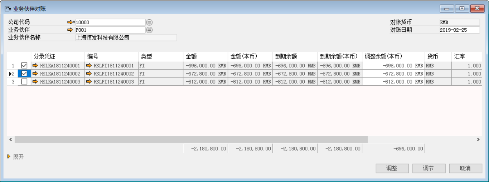
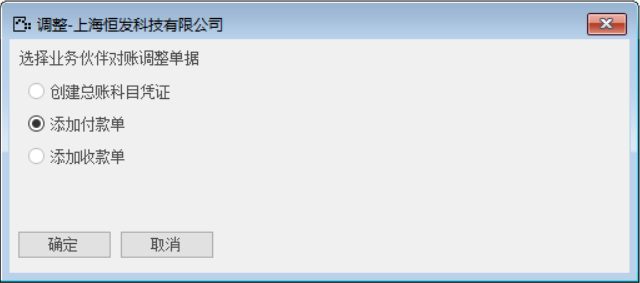

内部对账的目的是对业务伙伴的往来明细进行核销调节的过程，如果在收付款过程中对应性收付款的，则自动进行了核销。调节的目的是进行对选择的凭证进行核销后形成新的应收应付账款，前提是借贷方平衡，调整的目的是可以通过创建新的收付款单据进行核销。

#### **调节**

步骤1：从菜单窗口，【总账】-【内部对账】-【内部对账】，进入内部对账界面；

步骤2：选择公司代码以及具体的业务伙伴；

步骤3：选中要调节的分录凭证行；

步骤3：点击【调节】，进行对账操作；

调节：调整余额需要为零，即所选中的单据的调整余额之和为零。

 

调节后的余额是：

 

#### **调整**

调整：点击【调整】，则会出现调整单据列表，选中对应的单据进入该创建界面。

比如对当前供应商进行调整，选中要调整的明细行

 

单击调整，弹出创建付款单

 

如何创建付款单，则可参考应收账款和应付账款中具体的操作。