#### **一、介绍**

项目是为创建某一独特产品、服务或成果而临时进行的一次性努力。对项目更具体的解释是用有限的资源、有限的时间为特定客户完成特定目标的一次性工作。

项目通常是作为实现组织战略计划的手段而实现的。与公司的运作不同，项目具有非常明显的特点：临时性、独特性和渐进性。

项目管理,就是项目的管理者,在有限的资源约束下,运用系统的观点、方法和理论,对项目涉及的全部工作进行有效地管理。即从项目的投资决策开始到项目结束的全过程进行计划、组织、指挥、协调、控制和评价,以实现项目的目标。

项目构建就是制定整个计划，安排具体工作和内容以及分配人员的一个过程。在BAP系统中，项目构建功能在项目模块中，其打开路径为：【项目】-【项目构建】，打开界面如图所示：

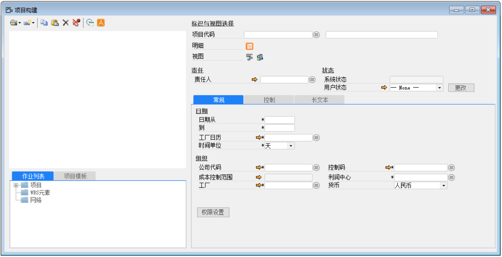 

#### **二、项目构建操作流程**

1、定义项目：点击项目代码旁按钮，然后点击【新建】按钮，输入项目代码和项目名称。

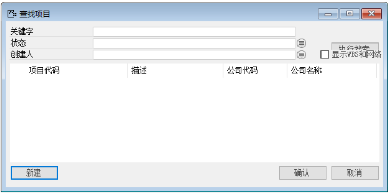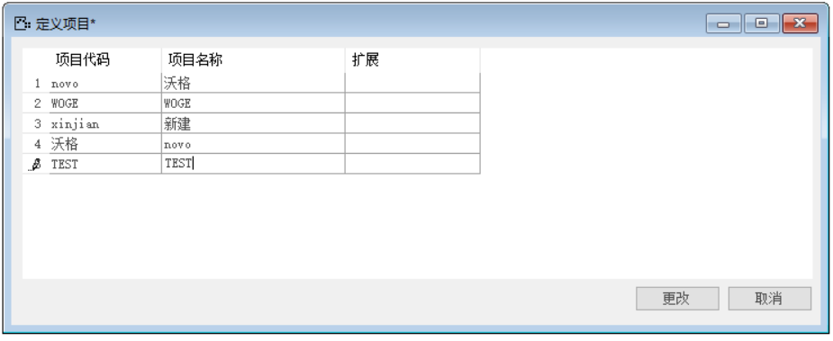 

2、在查找项目界面点击【执行查找】按钮，选择项目。

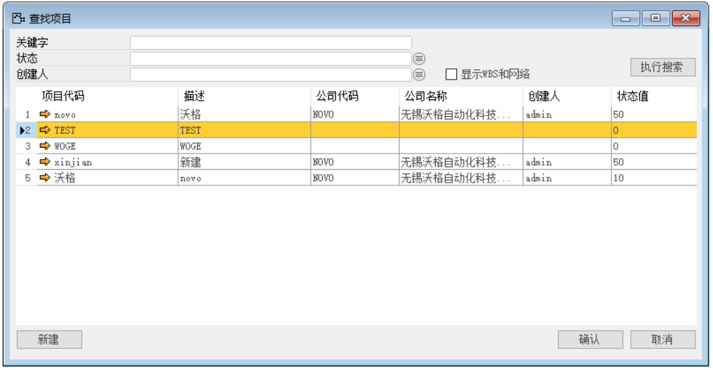 

3、完善项目构建常规标签页内的信息并定义项目控制码，然后点击工具栏按钮。

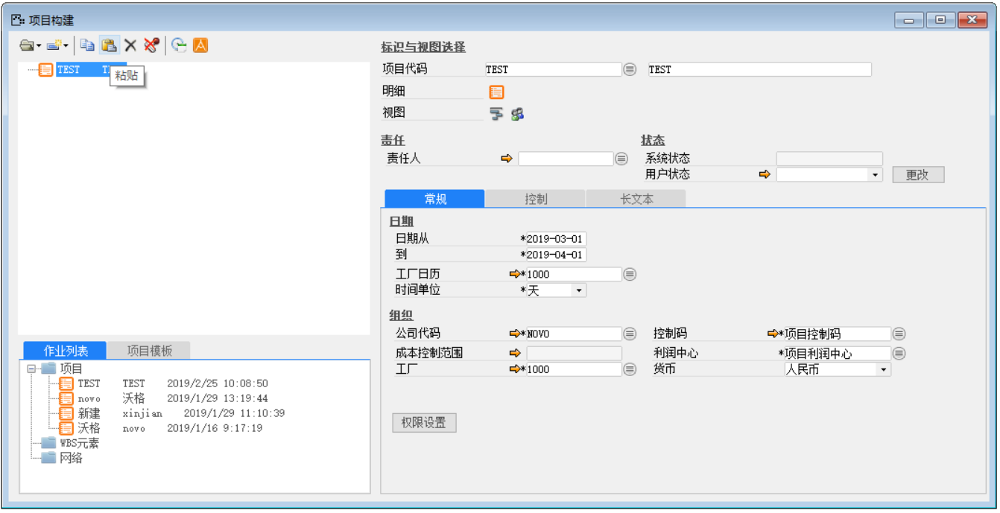

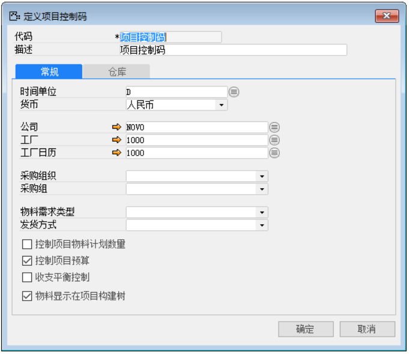 

4、设置项目控制权限：点击项目构建界面右下方【权限设置】按钮，输入代码和描述，选择权限人员并给予其对应权限。

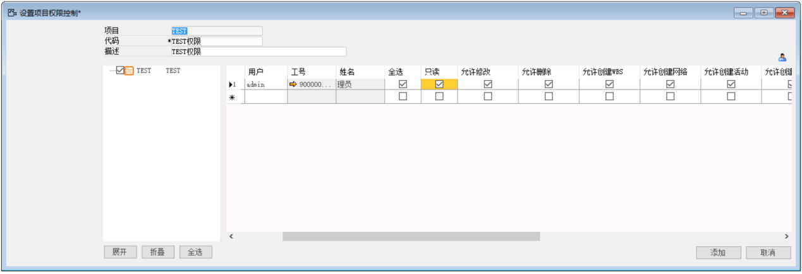 

5、分解WBS：点击项目构建界面内标识与视图选择栏内的按钮，分解项目。（1、WBS元素框内输入@001会自动带出项目代码+001。  2、WBS仍可以继续分解为更详细的WSB）

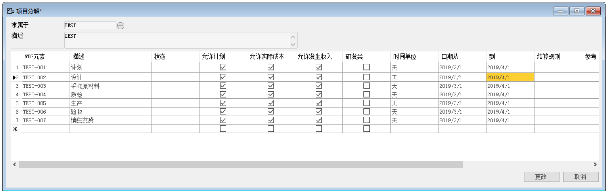 

6、具体任务活动分解：选择索要分解的WBS节点，在项目构建界面内标识与视图选择栏内点击按钮。

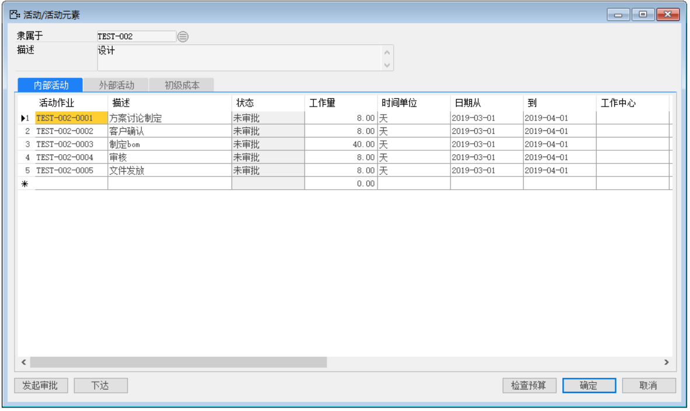 

7、活动分配人员：选择所要分配的活动，在项目构建界面内标识与视图选择栏内点击按钮，点击【导入员工】按钮，输入条件，点击【显示满足上述条件的员工】按钮，选择要分配的员工。

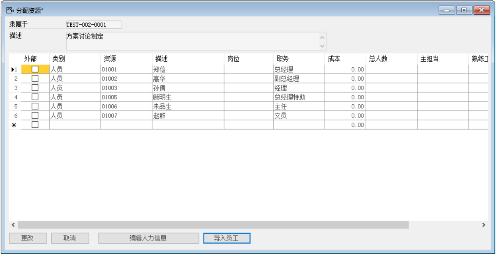 

8、分配材料:选择所要分配的节点，在项目构建界面内标识与视图选择栏内点击按钮，选择物料，发货方式，仓库，采购组织、采购组、需求类型、需求日期以及数量等信息。

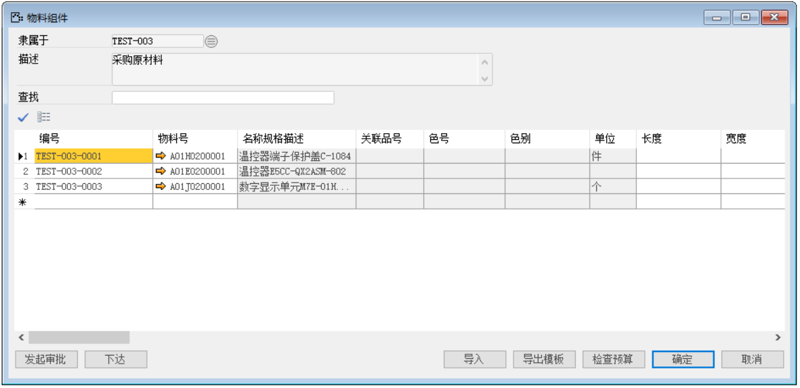 

项目构建完能在界面看到整个项目的安排。

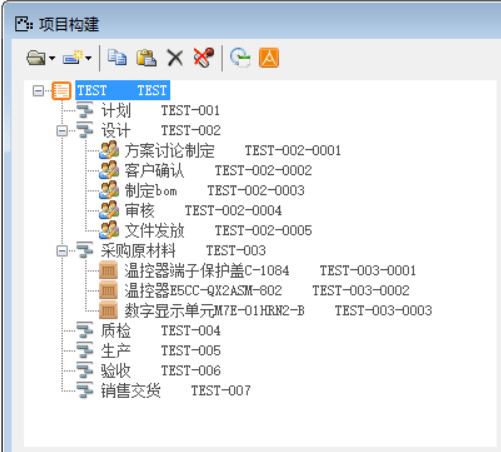 