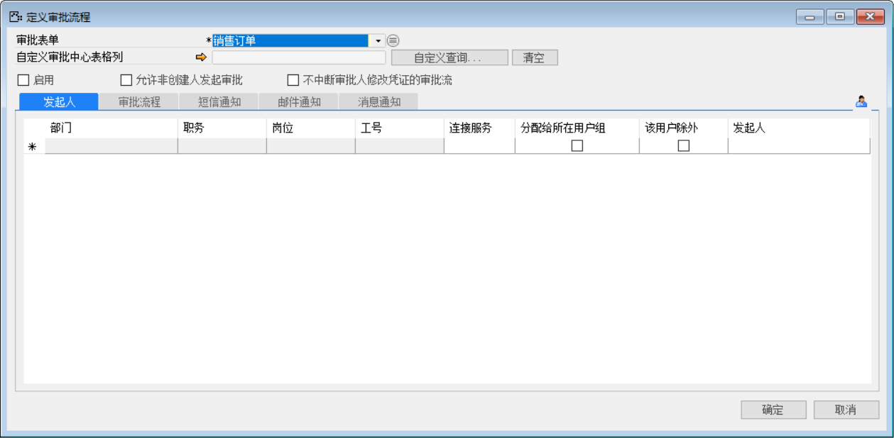
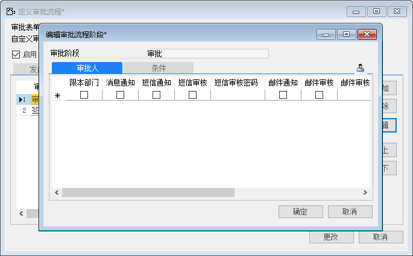
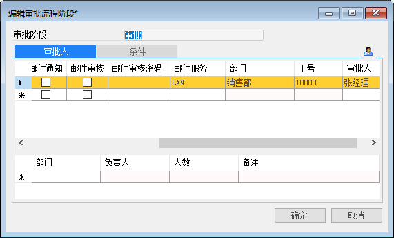
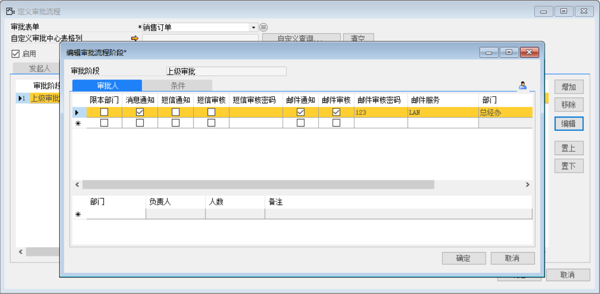
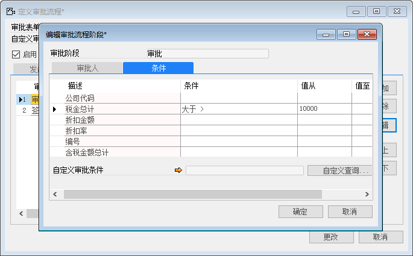
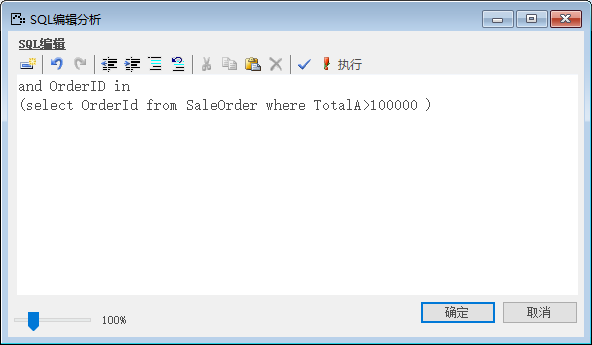
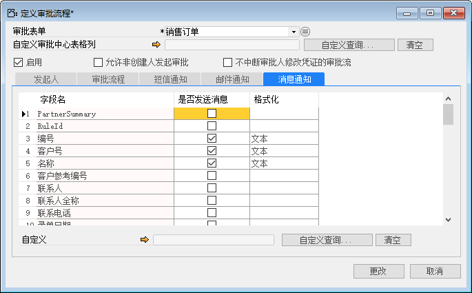
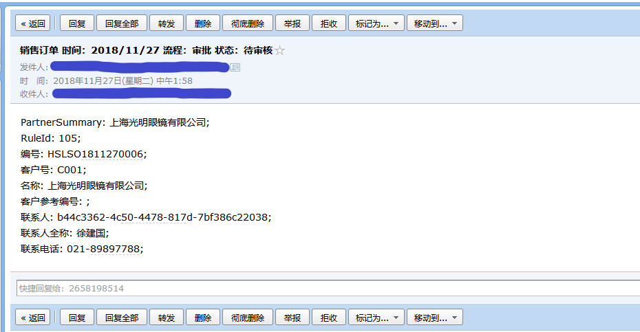

在实际业务中，通常情况下，为避免重要单据产生差错，都会有上级审批的流程。BAP系统提供强大的审批流配置功能，包括发起人、审批人、审批阶段、通知方式及审批条件等，可以满足企业复杂的审批流需求。

例如：对销售订单设置审批流

具体配置条件如下：

- 发起人：李四（李四可以发起销售订单的审批）

- 审批阶段：第一阶段由张经理审核；

第二阶段由赵总审核；

- 消息通知方式：系统内部消息，邮件通知；

- 审批条件：金额大于10000

1. 打开【管理】->【审批流程】->【定义审批流程】，设置新的“审批流程”； 

- 审批表单：销售订单；

- 启用：勾选

 

【审批表单】：选择需要配置审批流的表单；

【发起人】：选择单据审批流的发起人；

2. 单击【发起人】选项卡，在发起人一列处，选择此业务凭证审批流程的发起人（也可以单击按钮，打开选择用户窗口，在此窗口中选择发起人）； 

- 发起人：李四；

 

3. 单击【审批流程】选项卡，单击右侧【增加】按钮，选择一个或多个审批阶段；

- 增加：审批、签字；

- 消息通知：勾选；

- 邮件通知：勾选；

 

根据实际情况配置审批阶段，即先由张经理审核通过后再由赵总审批。

 

4. 选择需要编辑的审批阶段，单击【编辑】按钮，打开编辑审批流程阶段窗口；

根据实际情况，不同审批阶段选择不同的审批人。

 

在编辑审批流程阶段窗口中，单击【审批人】选项卡，在【审批人】一列处，选择该审批阶段的审批人（也可以单击按钮，打开选择用户窗口，在此窗口中选择发起人）；

- 审批阶段审批人：张经理；

- 签字阶段审批人：赵总；

5. 选择消息通知方式；（此步骤为可选）

- 通知方式：消息通知；（短信通知功能不可用）

 

6. 单击【条件】选项卡，输入预定义的条件和值；（此步骤为可选）

- 描述：税金总计；

- 条件：大于；

- 值：10000

 

7. 单击自定义审批条件部分的【自定义查询】按钮，打开自定义查询/报表窗口，选择所需要的查询；（此步骤为可选）

- 创建一个自定义审批流条件：销售订单总价大于10000的订单号；

- 语句：and OrderID in (select OrderId from SaleOrder where TotalA>100000 )

 

 

 

8. 在【邮件通知】选项卡中，选择发送字段和格式；（此步骤为可选）

**前提：需要提前配置好【消息服务管理器】**

- 发送字段：编号、客户号、名称；

- 格式：文本；

 

9. 在【消息通知】选项卡中，选择发送字段和格式；（此步骤为可选）

- 发送字段：编号、客户号、名称；

- 格式：文本；

 

10. 创建一张销售订单，因为含税金额总计大于10000，所以需要审批；

- 客户：C001；

- 物料号：KA00001；

- 数量：5000；

- 含税金额总计：2900000；

 

11. 打开审批人的邮箱的审批邮件；

 