由于运输过程造成损失或者产品质量等问题，即由于供货方造成的损失，都会产生退货。退货的目的是既要冲减应收账款，也要完成货物的退还手续，并进行损失申报，完成补发处理的过程。

销售退货一般分为：未开票销售退货和已开票销售退货

### **退货管理**

#### **未开票销售退货**

例：客户3月28号购买了50台12.01.042799.001和60台10.02.030496.002，货款现金支付，货物由于在运输过程中损坏了5台12.01.042799.001，所以客户现在进行退货需求。

前提：还未开票

1、打开【销售交货】业务窗口，找到需要退货的那张销售交货单

打开路径：【销售】-【销售交货】

- 【编    号】：000187；

- 【销售组织】：天津办；

- 【含税金额总计】：144000

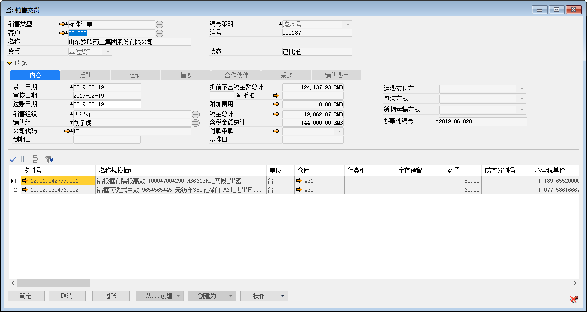 

2、根据销售交货单创建销售退货通知单；

- 【编  号】：000012；

- 【物料号】：12.01.042799.001；

- 【数  量】：5

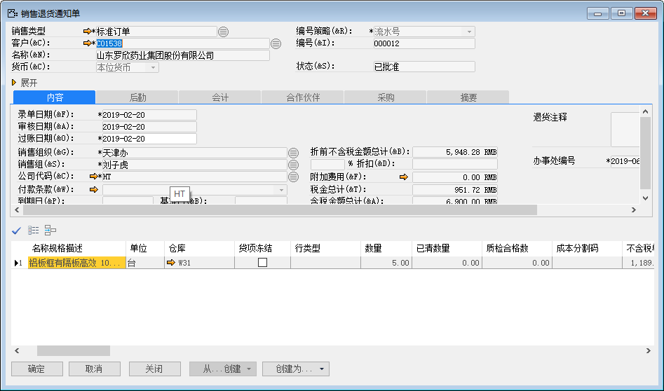 

3、根据销售退货通知单创建销售退货，添加、审批并发起过账；

- 【编  号】：000002；

- 【物料号】：12.01.042799.001；

- 【数  量】：5

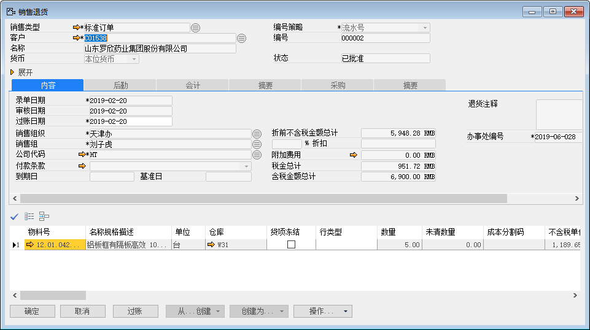 

#### **已开票销售退货**

例：客户3月28号购买了50台12.01.042799.001和60台10.02.030496.002，货款现金支付，货物由于在运输过程中损坏了5台12.01.042799.001，所以客户现在进行退货需求。

前提：已经开票

1、打开【销售退货订单】业务窗口，创建一张新的销售退货订单；

打开路径：【销售】-【预测/订单】-【销售退货订单】

- 【编  号】：000015；

- 【物料号】：12.01.042799.001；

- 【数  量】：5

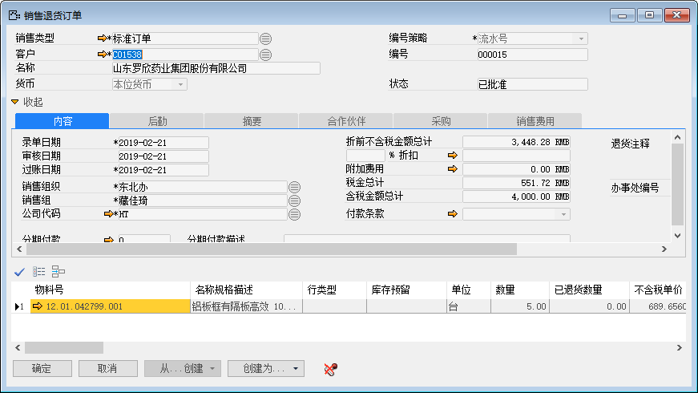 

2、根据销售退货订单创建销售退货通知，添加并发起审批；

- 【编  号】：000014；

- 【物料号】：12.01.042799.001；

- 【数  量】：5

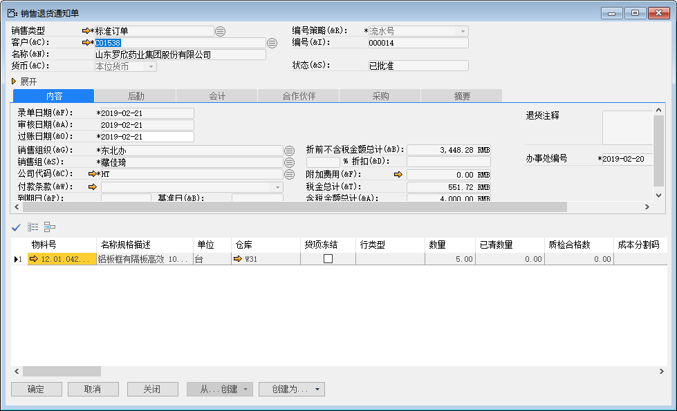 

3、根据销售退货通知单创建销售退货，添加、审批并发起过账；

- 【编  号】：000004；

- 【物料号】：12.01.042799.001；

- 【数  量】：5

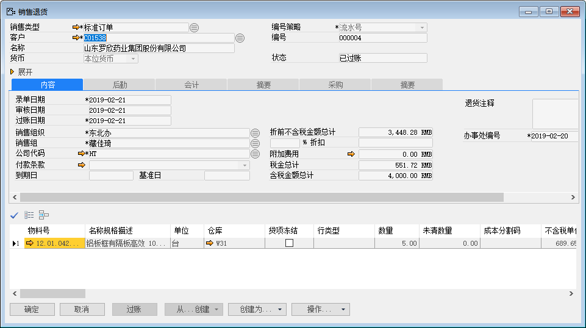 

4、根据销售退货单创建应收贷项凭证，添加并发起审批；

- 【编  号】：000001；

- 【物料号】：12.01.042799.001；

- 【数  量】：5

 

### **换货管理**

#### **未开票销售换货**

例：客户3月28号购买了50台12.01.042799.001和60台10.02.030496.002，货款现金支付，货物由于在运输过程中损坏了5台12.01.042799.002，所以客户现在进行换货需求。

前提：还未开票

1、打开【销售交货】业务窗口，找到需要换货的那张销售交货单

打开路径：【销售】-【销售交货】

- 【编    号】：000188；

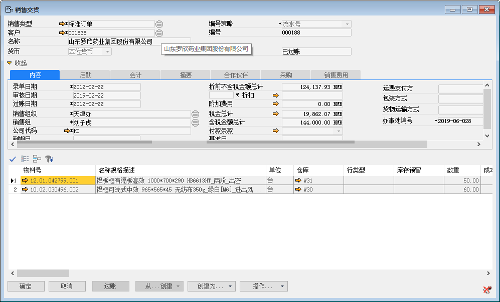 

2、根据销售交货单创建销售退货通知单；

- 【编  号】：000016；

- 【物料号】：12.01.042799.002；

- 【数  量】：5

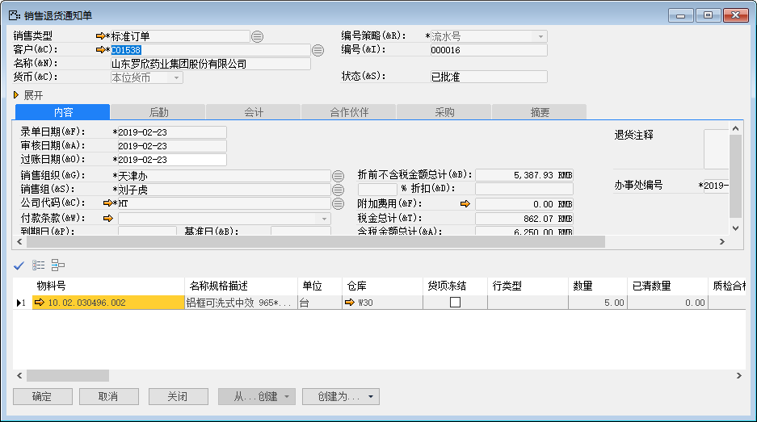 

3、根据销售退货通知单创建销售退货，添加、审批并发起过账；

- 【编  号】：000005；

- 【物料号】：12.01.042799.002；

- 【数  量】：5

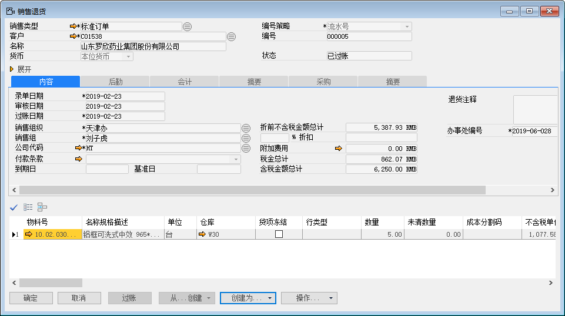 

4、根据销售退货单创建销售订单，销售类型为换货订单，销售物料为退货订单的物料；

- 【编  号】：000513；

- 【物料号】：12.01.042799.002；

- 【销售类型】：换货订单

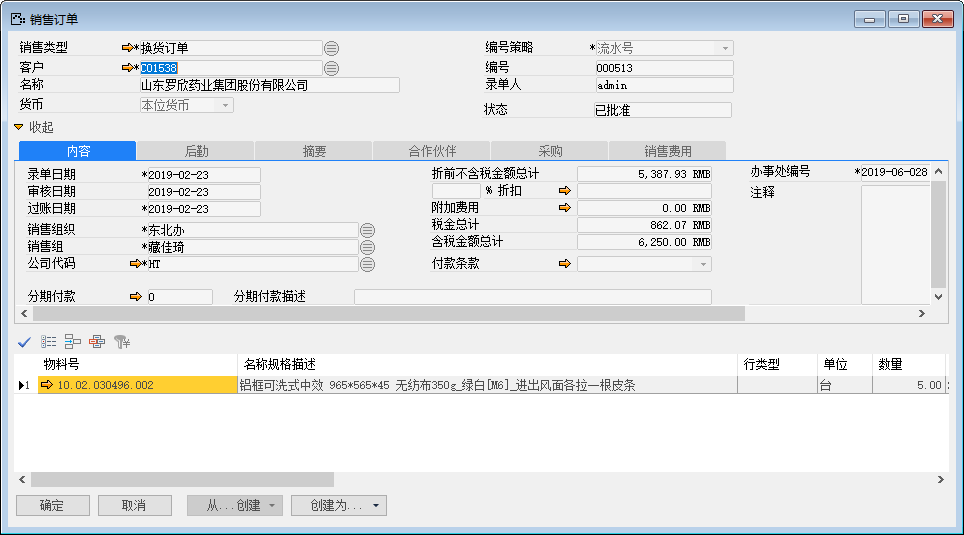 

5、根据换货订单创建销售交货，添加、审批并且过账；

- 【编  号】：000190；

- 【物料号】：12.01.042799.002；

- 【销售类型】：换货订单

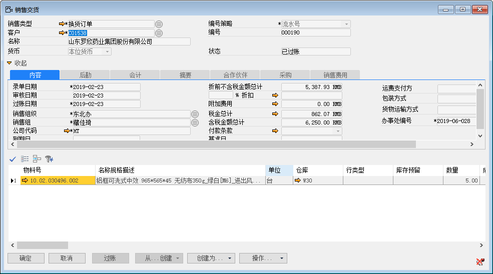 

#### **已开票销售换货**

例：客户3月28号购买了50台12.01.042799.001和60台10.02.030496.002，货款现金支付，货物由于在运输过程中损坏了5台12.01.042799.001，所以客户现在进行换货需求。

前提：已经开票

1、打开【销售退货订单】业务窗口，创建一张新的销售退货订单，订单的明细行的行类型选择为维修换货（E）；

打开路径：【销售】-【预测/订单】-【销售退货订单】

- 【编  号】：000017；

- 【物料号】：12.01.042799.001；

- 【行类型】：E

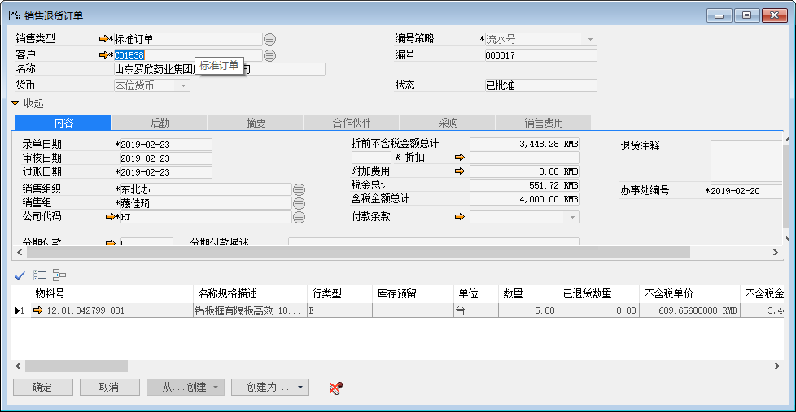 

2、根据销售退货订单创建销售退货通知，添加并发起审批，明细行的贷项冻结需要勾选；

- 【编    号】：000018；

- 【物 料 号】：12.01.042799.001；

- 【贷项冻结】：勾选

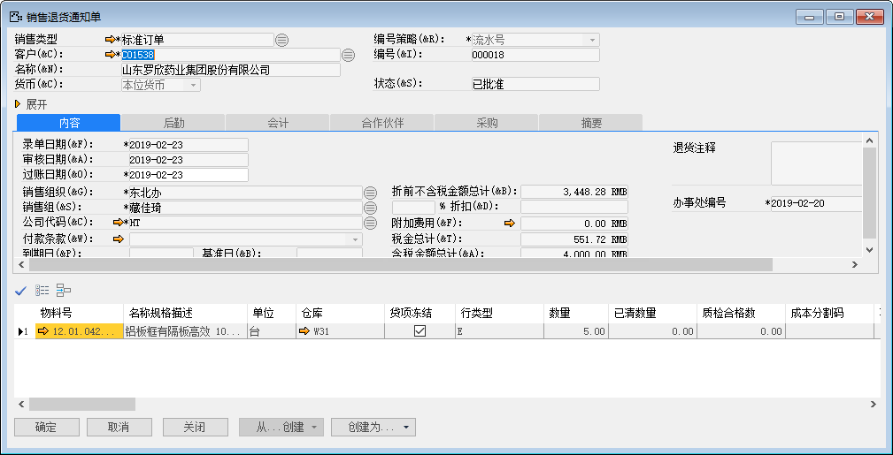 

3、根据销售退货通知单创建销售退货，添加、审批并发起过账；

- 【编  号】：000007；

- 【物料号】：12.01.042799.001；

- 【数  量】：5

 

4、根据销售退货单创建应收贷项凭证，添加并发起审批；

- 【编  号】：000001；

- 【物料号】：12.01.042799.001；

- 【数  量】：5

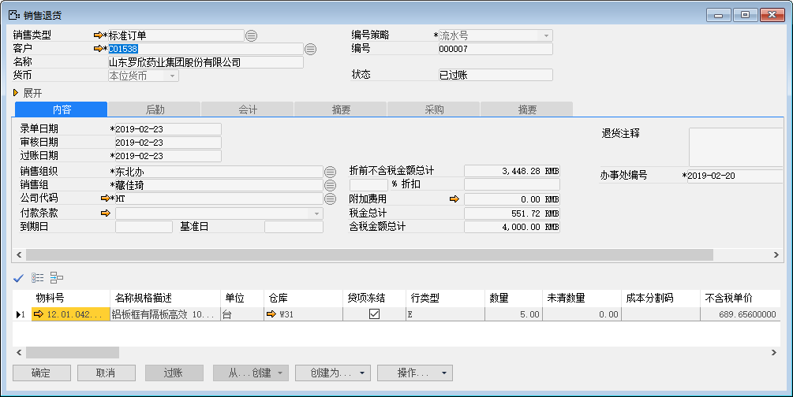 

5、根据销售退货单创建销售订单，销售类型为换货订单，销售物料为退货订单的物料；

- 【编  号】：000514；

- 【物料号】：12.01.042799.001；

- 【销售类型】：换货订单

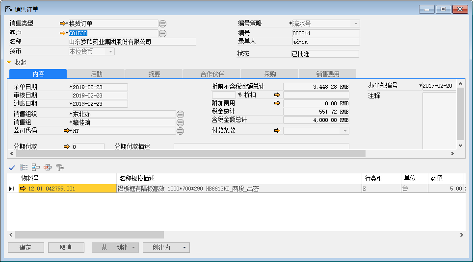 

6、根据换货订单创建销售交货，添加、审批并且过账；

- 【编  号】：000191；

- 【物料号】：12.01.042799.002；

- 【销售类型】：换货订单

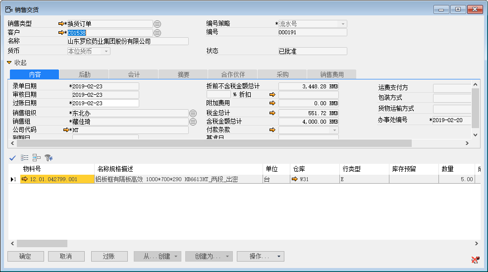 