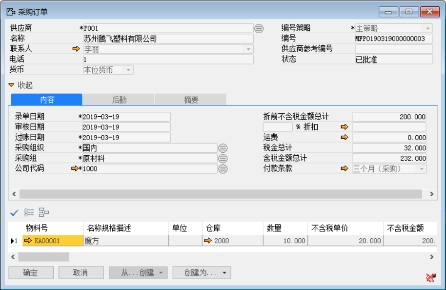
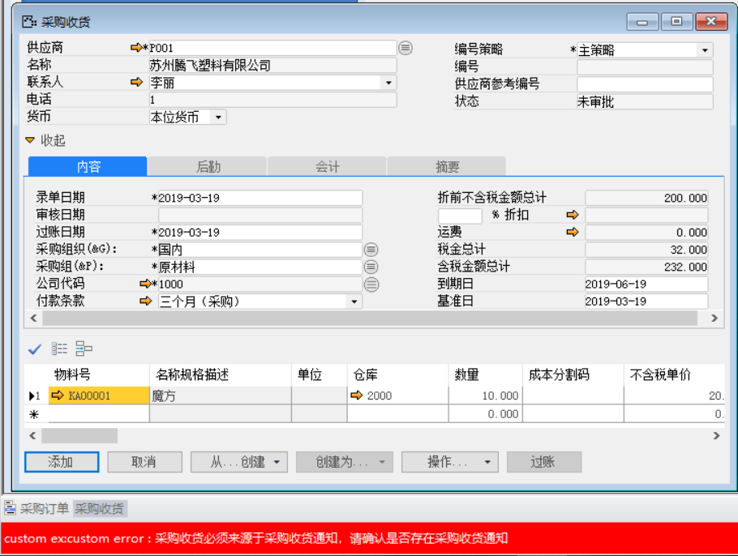
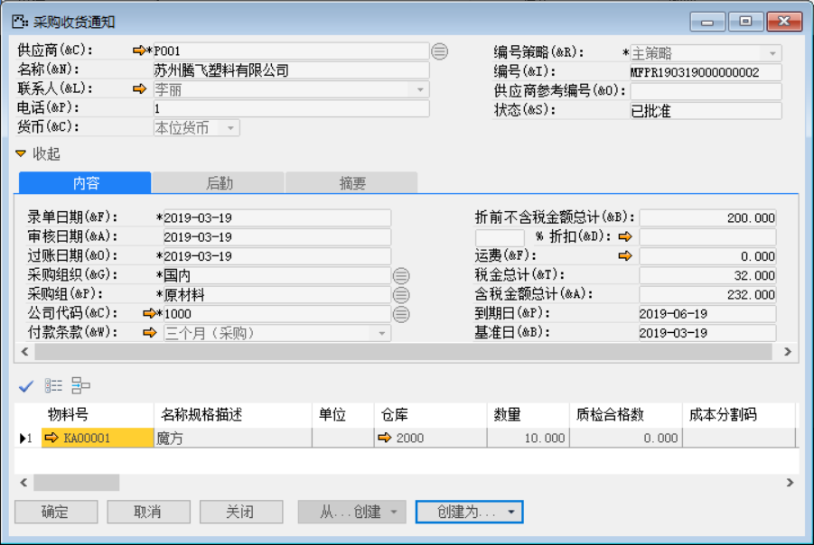
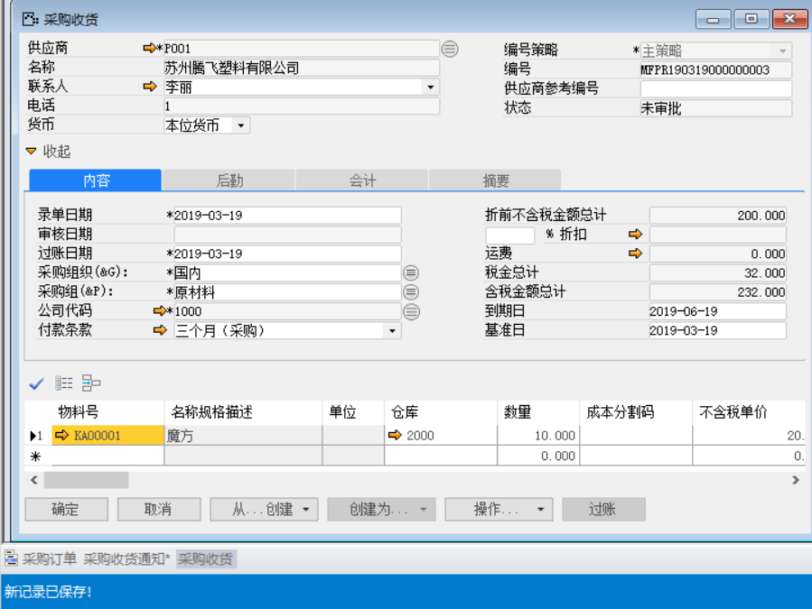
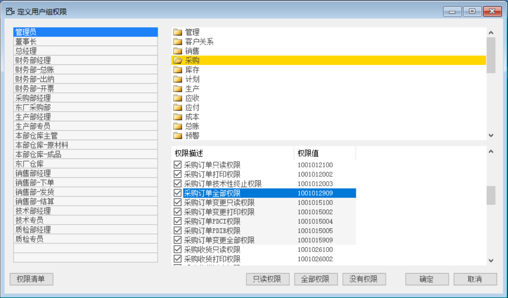
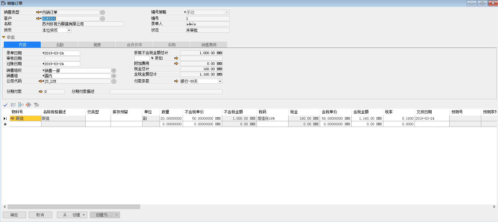
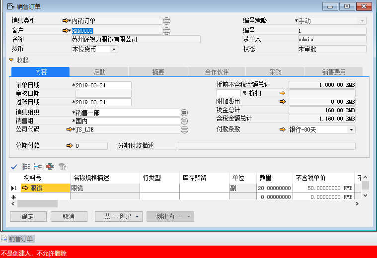
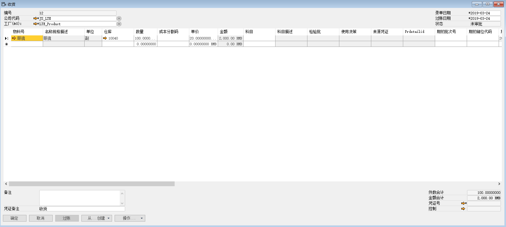
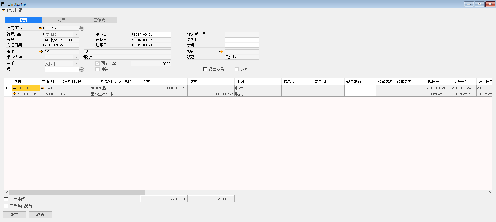

BAP NICER 5允许用户改变系统业务规则，用户可以利用数据库的后台存储过程来实现这种需求。分为以下三种存储过程：

1、 BeforeSaveCommitHandle—更改业务规则

2、 BeforeExcuteHandle—更改业务删除规则

3、GetSidEx-干预业务财务凭证 

一、 BeforeSaveCommitHandle

   该存储过程的控制是：在保存业务单据前对业务规则进行控制。

- 参数意义

| 序号 | 参数名称       | 数据类型      | 方向 | 含义                                   |
| ---- | -------------- | ------------- | ---- | -------------------------------------- |
| 1    | @HandleId      | int           | 输入 | 业务操作的权限值                       |
| 2    | @PowerTypeId   | int           | 输入 | 系统事务操作类别                       |
| 3    | @PkidString    | nvarchar(50)  | 输入 | 对象的主键值                           |
| 4    | @PkidStringEx1 | nvarchar(50)  | 输入 | 对象的主键值（多主键）                 |
| 5    | @PkidStringEx2 | nvarchar(50)  | 输入 | 对象的主键值（多主键）                 |
| 6    | @PkidStringEx3 | nvarchar(50)  | 输入 | 对象的主键值（多主键）                 |
| 7    | @ErroeMsg      | nvarchar(100) | 输出 | 返回的消息，如果不为空则会中止程序执行 |

- 业务权限值

业务操作的权限值从BAP NICER 5中可以获取

例如：获取销售订单权限值，步骤如下：

步骤一：从菜单窗口，管理->基础定义->一般->定义用户组权限，打开定义界面；

步骤二：任意选中一个用户组；

步骤三：点击右侧采购模块，在下方可以查看对应的权限值，

 

- 事务类别介绍

BAP NICER 5提供了5种固定的事务类别

| 序号 | 类别名称   | 值    | 说明                                             |
| ---- | ---------- | ----- | ------------------------------------------------ |
| 1    | 登录系统   | 10001 | 用户登录系统                                     |
| 2    | 浏览记录   | 10002 | 表示用户登录系统，该类型在更改业务规则中不起作用 |
| 3    | 创建新记录 | 10003 | 表示用户正在创建新记录                           |
| 4    | 修改记录   | 10004 | 表示用户正在修改记录                             |
| 5    | 删除记录   | 10005 | 表示用户正在删除记录                             |

- 操作举例

例如：运用BeforeSaveCommitHandle存储过程来控制‘采购收货必须来源于采购收货通知，请确认是否存在采购收货通知’，步骤如下：

1、编辑存储控制的代码；

-- =============================================

-- Author:		BAP Wind GX System

-- Description:	提交事务前进行干预

-- =============================================

ALTER PROCEDURE [dbo].[BeforeSaveCommitHandle]

 

@HandleId int, -- 事务句柄，通常用权限值。

@PowerTypeId int, -- 事务类别，通常用权限类别值（登录：，浏览：，创建：，更新：，删除：）。

@PkidString  nvarchar(50) , -- 事务涉及的对象主键值。

@PkidStringEx1  nvarchar(50) , -- 事务涉及的对象主键值。

@PkidStringEx2  nvarchar(50) , -- 事务涉及的对象主键值。

@PkidStringEx3  nvarchar(50) , -- 事务涉及的对象主键值。

@ErrorMsg nvarchar(100) output -- 返回的错误或者禁止事务继续执行的消息

 

AS

BEGIN

IF @HandleId=1001026909

BEGIN

IF(EXISTS(SELECT * FROM  mintd WHERE ptype=20 AND ISNULL(EX38,'')='' AND pid=@PkidString	 	

))

SET @ErrorMsg='采购收货必须来源于采购收货通知，请确认是否存在采购收货通知'

END

2、编辑完成，执行代码语句；

3、测试业务流程，打开系统菜单-采购-采购订单，发生一笔实际业务订单；

 

4、在执行完控制语句之后，我们假设，采购订单直接创建为采购收货单，是否可以；如果可以，则存储语句没有进行控制，语句错误；

 

5、在下推到采购收货，点击添加保存时，单据不允许保存，同时左下角报错信息显示出来，‘采购收货必须来源于采购收货通知，请确认是否存在采购收货通知’；

6、再测试，由采购收货通知来创建采购收货，是否可以；如果可以，则控制语句执行正确，做到预想的结果；

7、测试成功，存储过程语句是正确的。

 

二、 BeforeExcuteHandle

   该存储过程的控制是：开始执行操作时进行干预，更改业务删除规则。

- 参数意义

| 序号 | 参数名称       | 数据类型          | 方向 | 含义                                 |
| ---- | -------------- | ----------------- | ---- | ------------------------------------ |
| 1    | @HandleId      | INT               | 输入 | 事务句柄，通常用权限制               |
| 2    | @Uid           | nvarchar(20)      | 输入 | 用户名                               |
| 3    | @PowerTypeId   | INT               | 输入 | 事务类别，通常用权限值               |
| 4    | @PkidString    | nvarchar(50)      | 输入 | 事务涉及的对象主键值                 |
| 5    | @PkidStringEx1 | nvarchar(50)      | 输入 | 事务涉及的对象主键值                 |
| 6    | @PkidStringEx2 | nvarchar(50)      | 输入 | 事务涉及的对象主键值                 |
| 7    | @PkidStringEx3 | nvarchar(50)      | 输入 | 事务涉及的对象主键值                 |
| 8    | @ErrorMsg      | nvarchar(100) out | 输入 | 返回的错误或者禁止事务继续执行的消息 |

- 业务权限值

业务操作的权限值从BAP NICER 5中可以获取

例如：获取销售订单权限值，步骤如下：

步骤一：从菜单窗口，管理->基础定义->一般->定义用户组权限，打开定义界面；

步骤二：任意选中一个用户组；

步骤三：点击右侧采购模块，在下方可以查看对应的权限值，

 

- 事务类别介绍

BAP NICER 5提供了5种固定的事务类别

| 序号 | 类别名称   | 值    | 说明                                             |
| ---- | ---------- | ----- | ------------------------------------------------ |
| 1    | 登录系统   | 10001 | 用户登录系统                                     |
| 2    | 浏览记录   | 10002 | 表示用户登录系统，该类型在更改业务规则中不起作用 |
| 3    | 创建新记录 | 10003 | 表示用户正在创建新记录                           |
| 4    | 修改记录   | 10004 | 表示用户正在修改记录                             |
| 5    | 删除记录   | 10005 | 表示用户正在删除记录                             |

- 操作举例

如何利用该存储过程改变系统业务删除规则，以创建‘非创建人禁止删除销售订单’为例，步骤如下：

1、 编辑存储控制的代码；

-- =============================================

-- Author: BAP Wind GX System

-- Description: 开始执行操作时进行干预

-- =============================================

ALTER PROCEDURE [dbo].[BeforeExcuteHandle]

 

@HandleId int, -- 事务句柄，通常用权限值。

@Uid  nvarchar(20) , -- 用户名。

@PowerTypeId int, -- 事务类别，通常用权限类别值（登录：，浏览：，创建：，更新：，删除：）。

@PkidString  nvarchar(50) , -- 事务涉及的对象主键值。

@PkidStringEx1  nvarchar(50) , -- 事务涉及的对象主键值。

@PkidStringEx2  nvarchar(50) , -- 事务涉及的对象主键值。

@PkidStringEx3  nvarchar(50) , -- 事务涉及的对象主键值。

@ErrorMsg nvarchar(100) output -- 返回的错误或者禁止事务继续执行的消息

 

AS

BEGIN

    IF( @HandleId = 1000512909 AND @PowerTypeId=10005) -- 删除销售订单，不允许非创建人删除
    
       BEGIN
    
       IF(EXISTS(SELECT * FROM SaleOrder WHERE Orderid=@PkidString AND UID!=@Uid ))
    
           SET  @ErrorMsg ='不是创建人，不允许删除';
    
       END

END

2、 编辑完成，执行代码语句；

3、 测试业务流程，打开系统菜单-销售-销售订单，用‘admin’账号创建一张销售订单；

 

4、 切换账号‘张三’删除销售订单，系统报错，语句测试成功。

 

- 参数意义

| 序号 | 参数名称    | 数据类型       | 方向 | 含义               |
| ---- | ----------- | -------------- | ---- | ------------------ |
| 1    | @HandleId   | nvarchar(40)   | 输入 | 事务句柄，唯一标识 |
| 2    | @Uid        | nvarchar(20)   | 输入 | 用户名             |
| 3    | @SqlTextIn  | nvarchar(3000) | 输入 | 返回添加的SQL语句  |
| 4    | @SqlTextOut | nvarchar(3000) | 输入 | 返回添加的SQL语句  |

 

三、 GetSidEx

   该存储过程的控制是：总账科目设置干预。

- 参数意义

| 序号 | 参数名称    | 数据类型     | 方向 | 含义                 |
| ---- | ----------- | ------------ | ---- | -------------------- |
| 1    | @BillNo     | Nvarchar(40) | 输入 | 凭证号               |
| 2    | @BillType   | int          | 输入 | 凭证类型             |
| 3    | @Uid        | nvarchar(20) | 输入 | 用户名               |
| 4    | @Y          | INT          | 输入 | 凭证期间年           |
| 5    | @Mid        | nvarchar(20) | 输入 | 物料号               |
| 6    | @Whpkid     | nvarchar(60) | 输入 | 仓库PKID             |
| 7    | @KABRType   | INT          | 输入 | 总账科目设置类型     |
| 8    | @Fid        | nvarchar(20) | 输入 | 工厂                 |
| 9    | @Key        | nvarchar(50) | 输入 | 总账科目设置索引文本 |
| 10   | @CurrentSid | nvarchar(50) | 输入 | 当前的科目           |
| 11   | @ResultSid  | nvarchar(50) | 输入 | 返回的科目           |

- 业务权限值

请参考帮助文档

- 操作举例

例如：运用GetSidEx存储过程来控制将系统菜单库存收货的财务凭证改成生产收货的财务凭证，步骤如下：

1、  编辑存储控制的代码；

2、编辑存储控制的代码；

-- =============================================

-- Author: BAP Wind GX System

-- Description: 总账科目设置干预

-- =============================================

ALTER PROCEDURE [dbo].[GetSidEx]

 

@BillNo nvarchar(40), -- 凭证号。

@BillType INT, -- 凭证类型。

@Uid  nvarchar(20) , -- 用户名。

@Y INT, -- 凭证期间年

@Mid  nvarchar(20), -- 物料号

@Whpkid nvarchar(60), -- 仓库PKID。

@KABRType INT, -- 总账科目设置类型

@Fid  nvarchar(20), -- 工厂

@key nvarchar(50), -- 总账科目设置索引文本。

@CurrentSid nvarchar(50), -- 当前的科目。

@ResultSid nvarchar(50) output -- 返回的科目。

 

AS

BEGIN

 SET @ResultSid=@CurrentSid

END

 

    BEGIN

   IF(@BillType=0)

   BEGIN

     IF EXISTS(SELECT * FROM MINTN where @billno=NO )
    
     BEGIN
    
       IF (@key='库存抵消-增加科目')
    
       BEGIN
    
        SET @ResultSid='5001.01.03'
    
       END
    
       END
    
     END

END

3、编辑完成，执行代码语句；

4、测试业务流程，打开系统菜单-库存 -收货，收物料名为‘眼镜’的物料数量100副，单价20元；

 

5、库存收货保存，审批，过账产生财务凭证；

