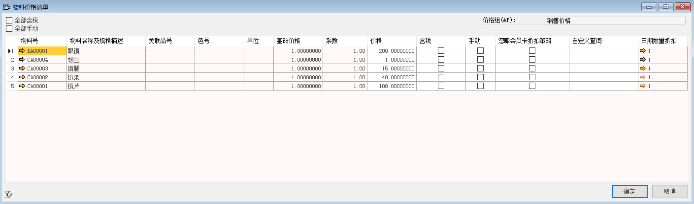
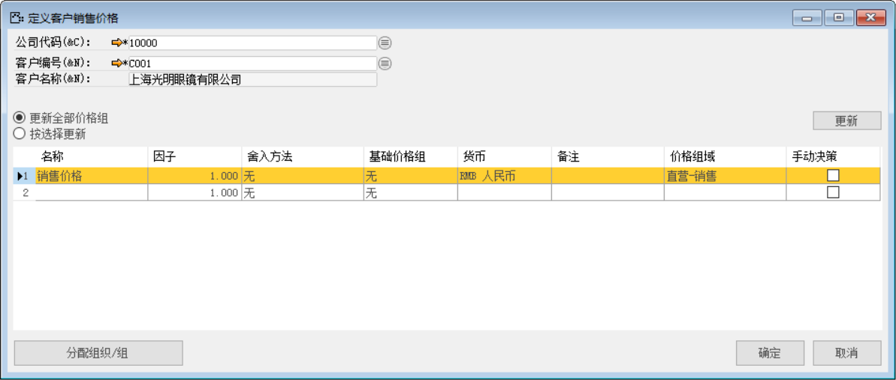
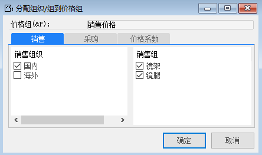
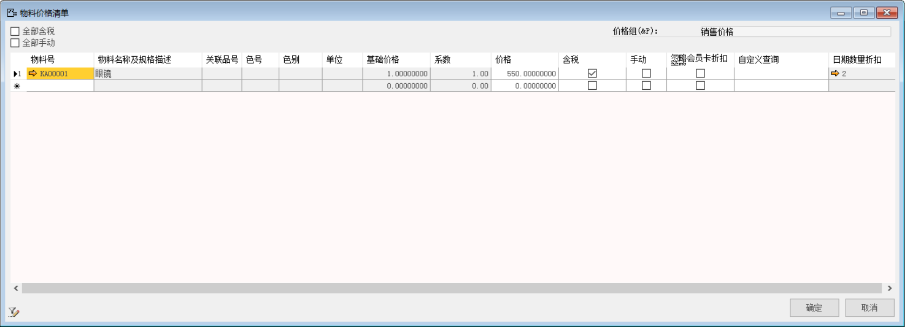
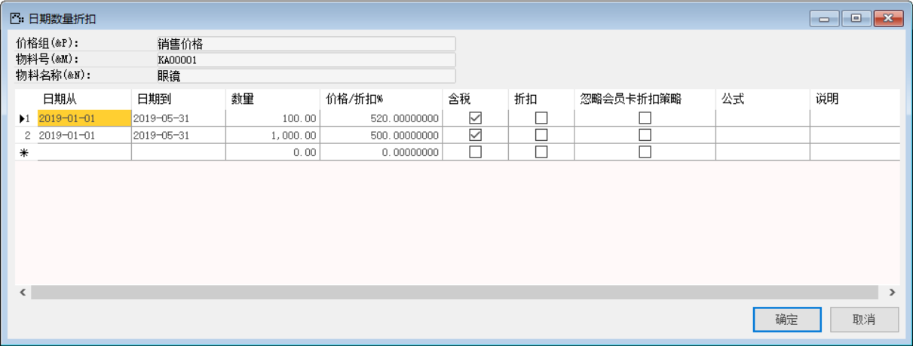
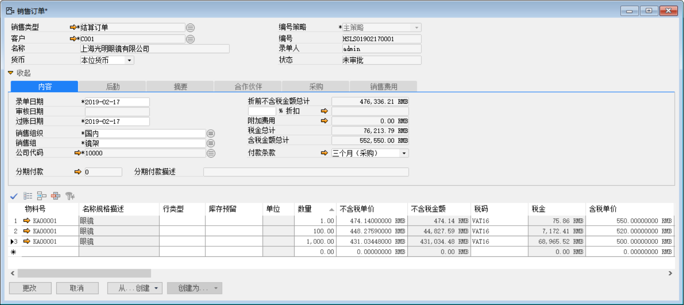

在企业的实际业务过程中，很多物料的采购或销售价格在一定时间一定数量下通常是固定的，因此价格管理功能能够有效的减少大量不必要工作，有效提高工作效率。

#### **普通价格管理**

物料对所有供应商或者客户的价格基本相同时：

1. 打开路径：从菜单窗口，【管理】-【基础定义】-【一般】-【定义价格组】，打开创建界面；

名称：采购价格、销售价格

价格组域：直营-采购、直营-销售

业务类型：采购、销售

编辑完成，单击‘添加’按钮进行保存

 

2. 选中采购价格行，双击行头，进入物料价格清单，编辑物料的采购价格，编辑物料号，物料描述，价格，编辑日期数量折扣填写日期从、日期到、价格/折扣；

物料号：KA00001；描述：眼镜；日期从：2018-11-08；日期到：2019-11-08；价格/折扣：130；

物料号：CA00004；描述：螺丝；日期从：2018-11-08；日期到：2019-11-08；价格/折扣：0.5；

物料号：CA00003；描述：镜腿；日期从：2018-11-08；日期到：2019-11-08；价格/折扣：10；

物料号：CA00002；描述：镜架；日期从：2018-11-08；日期到：2019-11-08；价格/折扣：30；

物料号：CA00001；描述：镜片；日期从：2018-11-08；日期到：2019-11-08；价格/折扣：60；

 

 

下同

3. 选中销售价格行，双击行头，进入物料价格清单，编辑物料的销售价格，编辑物料号，物料描述，价格，编辑日期数量折扣填写日期从、日期到、价格/折扣；

物料号：KA00001；描述：眼镜；日期从：2018-11-08；日期到：2019-11-08；价格/折扣：200；

物料号：CA00004；描述：螺丝；日期从：2018-11-08；日期到：2019-11-08；价格/折扣：1；

物料号：CA00003；描述：镜腿；日期从：2018-11-08；日期到：2019-11-08；价格/折扣：15；

物料号：CA00002；描述：镜架；日期从：2018-11-08；日期到：2019-11-08；价格/折扣：40；

物料号：CA00001；描述：镜片；日期从：2018-11-08；日期到：2019-11-08；价格/折扣：100

 

4. 编辑完成单击‘确定’按钮，返回到最初页面，选中销售价格行，单击‘分配组织/组’按钮，进行分配销售组织，销售组；

销售组织：国内；销售组：镜架、镜腿

 

选中采购价格行，单击‘分配组织/组’按钮，进行分配采购组织，采购组；

采购组织：国内；采购组：镜片、螺丝；

 

分配完成，销售采购价格定义完成，在销售或采购订单选择已分配销售采购价格的物料后，价格会自动带出分配的价格。

#### **特殊价格管理**

同一物料针对不同供应商或者客户其价格不同。

例如：好视力眼镜公司对客户光明眼镜就某款眼镜达成销售协议如下：

在2019年1月1日到5月31日期间，

当该款眼镜销售数量小于100时，含税单价为550元；

当销售数量大于100小于1000时，含税单价为520元；

当销售数量大于1000时，含税单价为500元。

1. 打开【定义客户销售价格】，选中需要制定相应销售政策的客户，创建如下：

 

将该方案分配到销售组织、销售组

 

2. 双击表格明细行行头部分，数字【1】位置，打开【物料价格清单】，填写默认价格550，勾选含税；

 

3. 再点击【日期数量折扣】表格的箭头，打开【日期数量折扣】界面，根据销售协议填写对应内容

 

4. 接下来在日期范围内创建该客户就该眼镜的销售订单时，会自动根据数量不同带出不同的价格

 

针对不同供应商创建不同采购价格操作基本相同，第一步打开【定义供应商采购价格】，后续操作基本同上。