# 《BAP客户化扩展应用实例》

# 第一章 如何实现物料之间附件共享

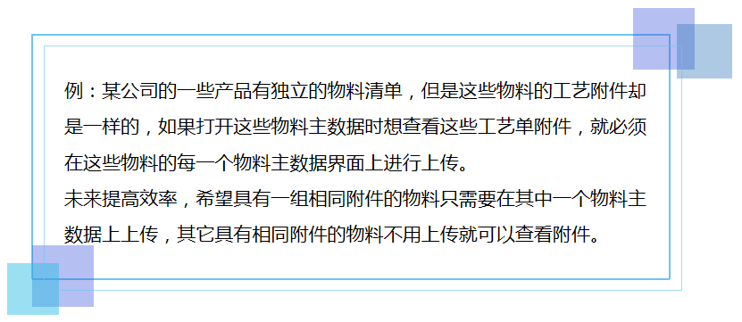

  

  

 

BAP只提供了物料主数据上传附件，要实现这个需求，可以利用BAP的上下文菜单功能实现。

 

  

 

1、创建用户表：物料附件共享。菜单路径：工具->定义用户表
 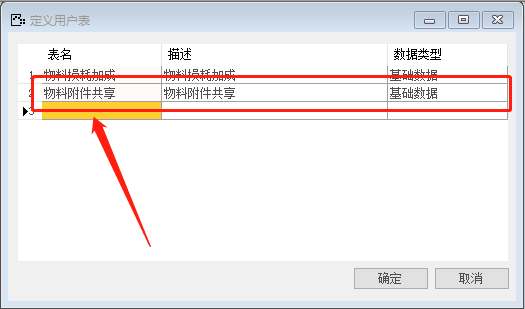
2、创建【物料附件共享】表的字段：主物料号、共享物料号。菜单路径：工具->管理用户字段

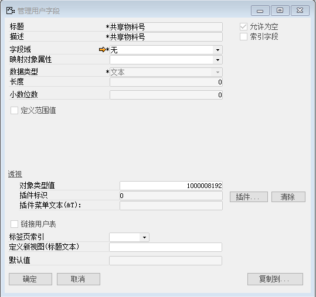
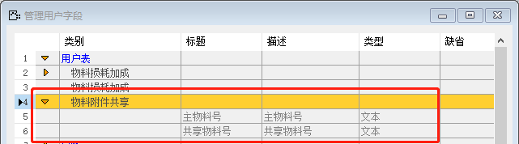

3、输入【物料附件共享】内容。菜单路径：工具->维护用户表数据

 

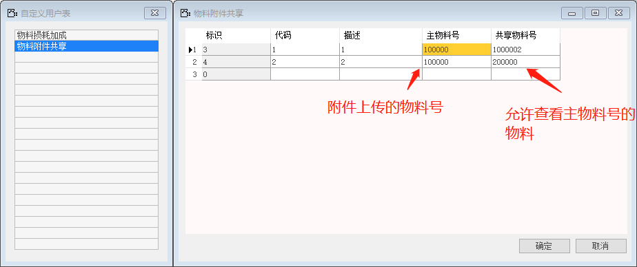

 

4、创建自定义查询。菜单路径：工具->自定义查询/报表

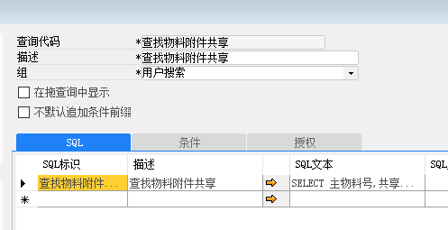

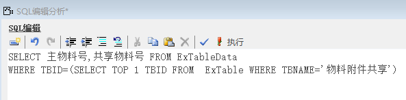

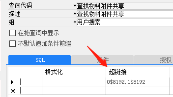

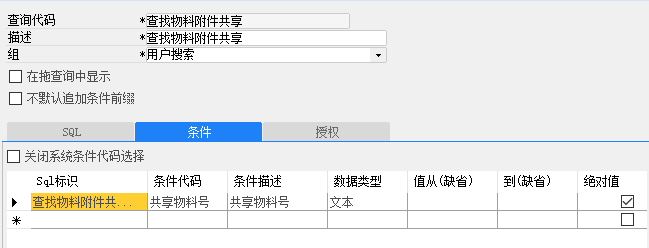 

5、定义上下文菜单项命令内容。菜单路径：工具->开发->定义上下文菜单项命令内容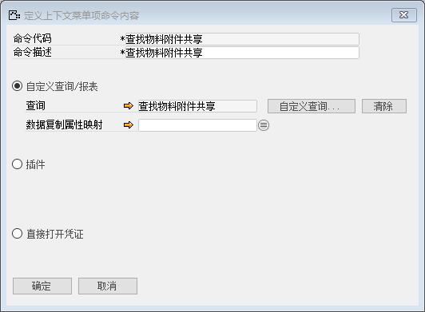

 

6、定义上下文菜单项。菜单路径：工具->开发->定义上下文菜单项

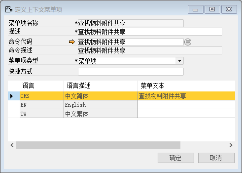

 

7、打开物料主数据窗口，定义窗口上下文菜单结构。菜单路径：工具->开发->定义窗口上下文菜单结构

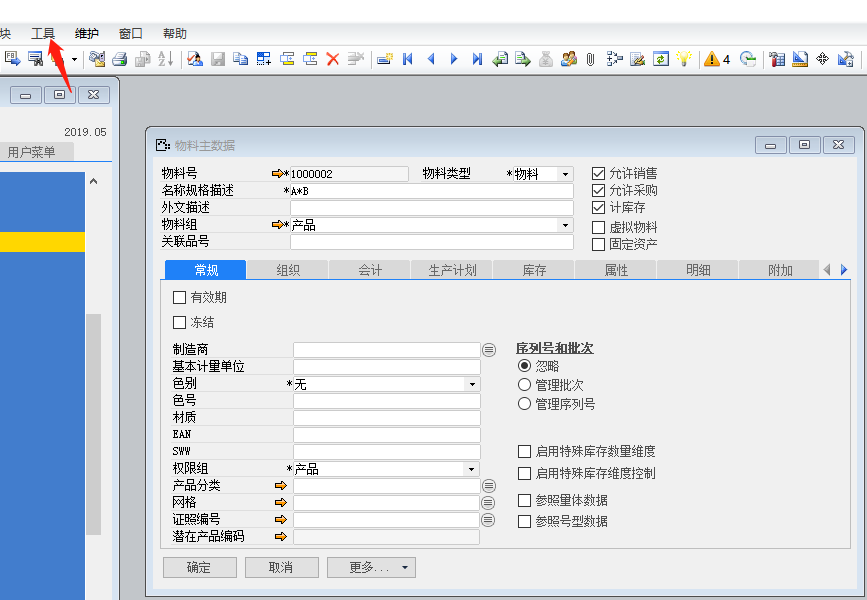

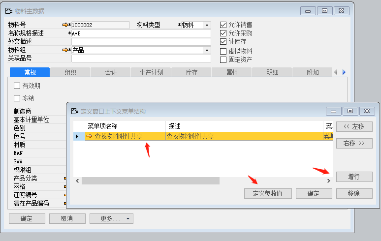

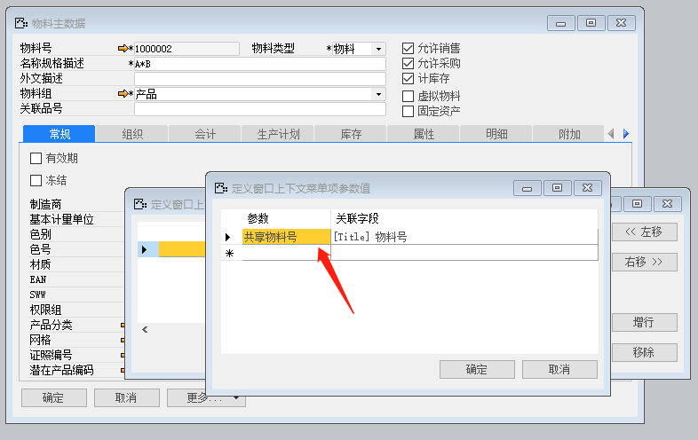

 

 

**8、****练习：**

(1)       打开某物料主数据

(2)       单击操作菜单，或在物料主数据窗口右击，打开上下文菜单：查找物料附件共享

(3)       在打开的条件窗口上点击确定，系统显示可以共享的物料表，

(4)       点击主物料号，打开主物料的物料主数据即可查看附件