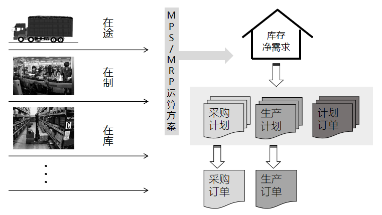
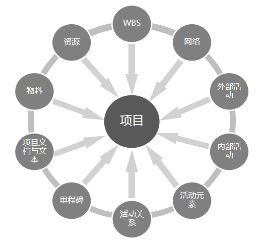
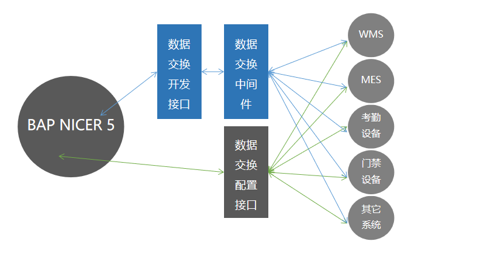

**销售业务循环**

BAP NICER 5销售与应收账款业务循环包括从订单到收款的完整闭环，支持预测、分销等销售业务类型；销售组织和销售组是销售业务循环的组织维度边界

 

**销售财务循环**

BAP NICER 5销售与应收账款业务循环集成财务循环，财务数据实时产生，财务凭证实时生成

 

**采购业务循环**

BAP NICER 5采购与应付账款业务循环包括从订单到付款的完整闭环，支持请购、委外等采购业务类型

 

**采购财务循环**

BAP NICER 5采购与应付账款业务循环集成财务循环，财务数据实时产生，财务凭证实时生成

 

**生产计划循环**

BAP NICER 5生产计划循环从销售订单或者计划驱动，包括生产成本管理和生产作业执行等功能，可以满足企业自制和委外需求

 

**生产与成本集成**

BAP NICER 5在期末都需要对生产订单进行成本还原，以真实反应每一个生产订单的准确成本，成本还原可以有效的帮助企业不断修正售价策略，也可以及时发现制造环节的问题

**人力资源管理**

BAP NICER 5人力资源管理是从岗位需求规划到员工岗位生命周期管理全流程，薪酬与财务实时集成，考勤结算自动化，薪酬过账财务自动化

 

**工程项目管理**

BAP NICER 5工程项目管理可以满足不同类型、从复杂到简单项目管理需求，尤其与其他业务模块以及财务模块是实时集成

 

**与第三方系统集成**

BAP NICER 5可以方便的与任何第三方系统进行集成，BAP NICER 5 数据交换接口配置实现

 

**消息请求进程队列技术**

BAP NICER 5的消息请求进程队列技术可以提升服务器应用能力，并且可以方便运维审计与平衡计算能力

