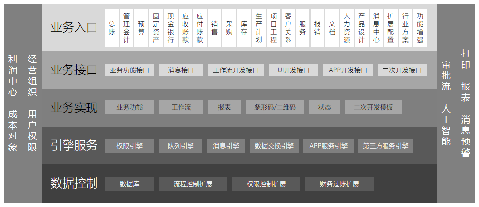

**BAP NICER 5 概述**

面向大中型集团化多组织、多语言、跨行业、业务财务高度实时集成，基于内存数据库与人工智能技术；BAP NICER 5 企业管理套件，包括 ERP / HR / PLM / MES 4款软件产品

 

**应用场景**

无论是跨国跨行业多公司经营模式；无论是多层次分销模式，或者是事业部经营模式，BAP NICER 5都可以满足多组织管理需求；

无论是制造型企业和服务行业，或者是商业零售与项目工程行业，或者医疗机构等，BAP NICER 5都有强大的行业适应性

 

**技术架构**

BAP NICER 5 采用N层架构，分为视图层、核心计算层、核心层、数据层，4层分布式架构具有良好的伸缩性，可以满足从简单到复杂、从小规模到大集团的大跨度应用需求

 

**组件架构**

BAP NICER 5 的组件化架构保证系统更稳定、更安全，扩展开发基于统一组件接口，更加保证了数据的安全性组件功能齐全，分类明确，满足产品不断迭代与二次开发需求

 

**网络部署示意**

BAP NICER 5 具有强大的网络与服务器部署伸缩性，无论是一台服务器或者安全性更高更复杂的网络环境都能轻松部署；BAP NICER 5 网络架构既能满足企业高数据安全需求，也能满足 Work Anywhere 需求

 

**产品框架**

BAP NICER 5 具有强大的网络与服务器部署伸缩性，无论是一台服务器或者安全性更高更复杂的网络环境都能轻松部署；BAP NICER 5 网络架构既能满足企业高数据安全需求，也能满足 Work Anywhere 需求

