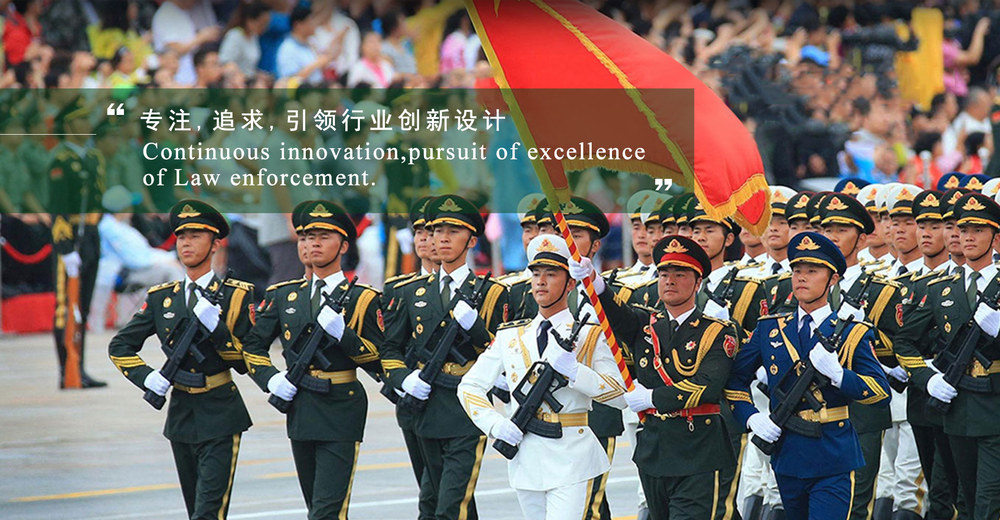

江苏卡思迪莱服饰有限公司位于国家级南京市栖霞区新港经济技术开发区，公司现有员工1500人，固定资产逾2亿元。占地80000平方米的花园式工厂，拥有先进的进口设备及技术，凭借自身的实力，与美国、日本、欧洲及中东地区有常年的服装出口的合作，年出口量100万件套。卡思迪莱品牌的高档西服和职业装年销售50万件套，各式制服100万件套，各式大沿帽100万顶，年销售总额超5亿元。公司已通过ISO9001、2000版的国际质量体系的转换。

