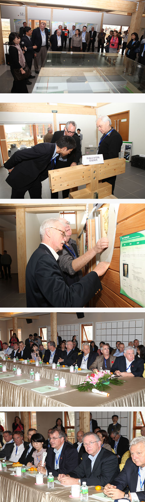

中国最大的整体木结构设计建造商皇家集团借助BAP Business Cloud完成集团对集团所有子公司及分公司的信息流、财务流、业务流的整合。

 

“剖析一个企业的管理业务可以发现，企业就是由一个个岗位组成的，而各个岗位通过业务联系交织在一起，构成了一个有机的复杂的整体，通过业务操作层，管理层，决策层的协调工作，来达成企业的目标。如销售业务就是销售员报价，业务员处理订单，生产安排生产，仓库发货，财务结算收款协调在一起。而各个岗位之间的协同能力，决定了企业运作的效率和效益。所以让企业的每个岗位协调高效运转是现代企业追求的目标，BAP Business Cloud的导入大大地推进了这样的进程。明确规范每个岗位的职责（业务处理）：凭什么处理；怎么处理；提供怎样的结果三个方面是每个岗位需要考虑的，通过BAP Business Cloud系统将岗位联系起来，形成了企业中有形系统（每个岗位）与无形系统（岗位之间的衔接）的统一，带动企业往前推进”

---- 沈建新 ，苏州皇家整体住宅系统股份有限公司常务副总经理

 