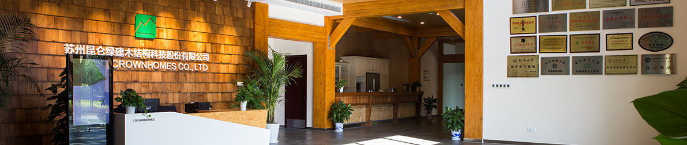

苏州皇家整体住宅系统股份有限公司从2001年开始，就致力于将自主研发的众多高效实用的节能环保技术和设备，与木结构建筑进行科学地整合应用，弥补和改变传统木结构建筑的各种不足。历经十年的市场风雨洗礼和坚持不懈，目前，公司现代木结构低碳节能建筑的各项技术和服务均达到行业领先水平。

 

引入国外现代木结构建筑理念和技术起步，业务涵盖了木结构建筑设计、研发、制造、配送、施工、维修各个环节，可以为客户提供个性化木结构建筑的整体解决方案。

公司具有自主设计、工厂预制、现场搭建施工一体化能力，拥有成套、专用的现代化加工设备，按照设计图纸要求拆分设计，制造各类木结构墙体、屋架、桁架、工程木梁柱和金属连接件，实施专业化的现场施工搭建。

在低碳节能环保住宅建设领域共申报各项专利百余项。公司被认定为“江苏省级企业技术中心”、“江苏省高新技术企业”；被评为“苏州创新先锋企业”。参与了《木结构施工技术规范》等多部国家规范、行业标准、施工工法的编著。